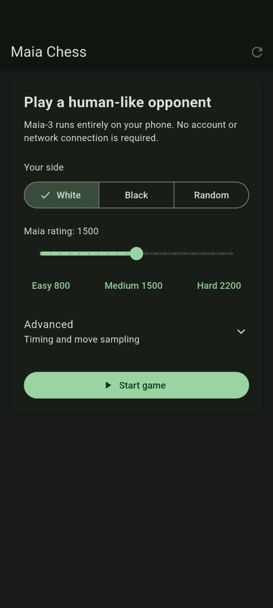
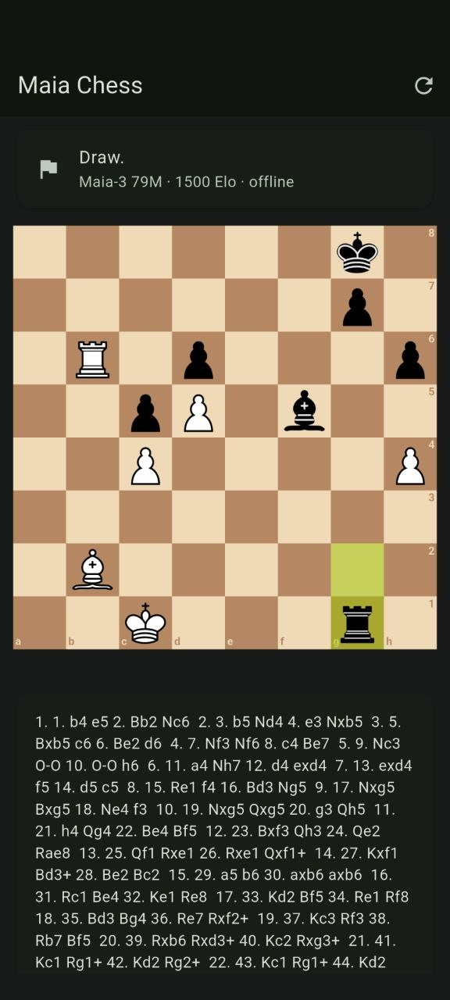

# Maia Chess for Android

An offline-first Android chess app for playing against Maia-3, reviewing games
with Maia and Stockfish, and exporting PGN.

Built around [Maia-3](https://github.com/CSSLab/maia3), the human-like chess
engine developed by the University of Toronto Computational Social Science Lab.

## Screenshots

<p align="center">
  
  
  
</p>

## MVP features

- Bundled Maia-3 79M model; no account, server, or network connection required
- Play as White, Black, or a random side
- Easy (800), Medium (1500), Hard (2200), or custom Elo
- Optional human-like move timing with persistent advanced settings
- Adjustable Maia Temperature and Top-P from 0 to 1 (defaults 0.5 and 0.9)
- Lichess Chessground board with the default brown theme and Cburnett pieces
- Legal move handling, checkmate/draw detection, move list, and rematches
- Resignation and post-game Home/Rematch actions
- Move-by-move review with evaluation bar and board navigation
- Independent Stockfish/Maia recommendations with colour-coded arrows
- Inaccuracies, mistakes, and blunders based on centipawn loss
- Tagged PGN export with players, event, date, result, and termination

## Build

Requirements: Flutter 3.47+, JDK 17, and Android SDK 36.

```sh
flutter pub get
flutter analyze
flutter test
flutter build apk --release --target-platform android-arm64
```

The APK is written to `build/app/outputs/flutter-apk/app-release.apk`.

## Re-export Maia-3

The checked-in ONNX model was exported from the official Maia-3 79M checkpoint.
The exporter verifies ONNX Runtime outputs against PyTorch before succeeding.

```sh
python -m pip install /path/to/maia3 onnx onnxruntime
python tool/export_maia3_onnx.py --model maia3-79m --output assets/models/maia3-79m.onnx
```

## Maia-3 credit

Maia Chess for Android uses the
[Maia-3 project](https://github.com/CSSLab/maia3) and its 79M model. Maia-3 was
created by the University of Toronto Computational Social Science Lab to model
human chess move choices at different rating levels. The app includes an About
screen linking directly to the upstream project and source code.

## Licensing

Original application code in this repository is licensed under MIT. The bundled
application also contains separately licensed third-party components, notably
Maia-3 (AGPL-3.0) and Stockfish/multistockfish (GPL-3.0). See
[`THIRD_PARTY_NOTICES.md`](THIRD_PARTY_NOTICES.md). Distribution of the combined
APK must comply with those component licences.

This is an independent community project and is not an official Maia Chess,
University of Toronto CSSLab, Stockfish, or Lichess application.
