# Mobile Maia

Mobile Maia is a free and open-source Android app for playing against
[Maia-3](https://github.com/CSSLab/maia3), reviewing games with Maia and
Stockfish, and exploring the difference between the best computer move and the
move a human is actually likely to play. Everything runs locally on the phone.

Maia-3 is the latest generation of the human-like chess model developed by the
University of Toronto Computational Social Science Lab. Published as part of
the [Chessformer paper at ICLR 2026](https://openreview.net/forum?id=2ltBRzEHyd),
its largest model achieved 57.1% human move-matching accuracy—a new state of the
art in the paper's evaluation.

That may not sound extraordinary until you consider how many reasonable moves
there can be in a chess position. Maia is not trying to calculate the
objectively best move. It is trying to predict what a person will actually
play. That difference is the reason Mobile Maia exists.

### A patient, human-like sparring partner

Choose a Maia rating from 500 to 2500 and play as White, Black, or a random
side. The aim is not to imitate a weakened superhuman engine that plays
perfectly and then drops a piece for no human reason. It is to provide a
level-appropriate opponent whose choices resemble human choices.

Maia will never rage quit, cheat, send abuse in chat, or become impatient while
you think. If you want to spend ten minutes working through a position, it will
still be there when you are ready.

### Complete game review on your phone

[Free Chess.com accounts have a daily Game Review limit](https://support.chess.com/en/articles/8584089-how-does-game-review-work).
If you have used that allowance, or played anonymously on Lichess without a
server-side computer report, Mobile Maia provides another route: copy the PGN,
paste it into the app, and run the review locally.

The review includes separate White and Black accuracy scores, a
tap-to-navigate evaluation graph, opening, middlegame, and endgame sections,
and move classifications including Brilliant, Good, Interesting, Dubious,
Mistake, and Blunder. You can step through Stockfish's preferred lines and
export the reviewed game as annotated PGN.

There is no review quota because there is no server to ration. Stockfish runs
on the phone.

### Analysis that asks what a human will play

Mobile Maia answers two different questions on the same board:

- What is the best move according to Stockfish?
- What is the move a human at this rating is most likely to play?

Blue arrows show Stockfish's leading choices and the orange arrow shows Maia's
likely human move at the selected rating. When they agree, the app combines
them into a two-tone arrow.

This is especially useful in opening preparation. An engine can tell you that
an idea is refuted by perfect play, but your real opponent will not have an
evaluation bar. Maia helps you explore the replies that players at your level
are actually likely to find—and the positions in which a natural move may lead
them into trouble.

Maia does not replace Stockfish. It makes Stockfish's answer more useful by
placing it beside a model of human behaviour.

### Built in the spirit of Lichess

Mobile Maia follows Lichess in both design and philosophy: simple, clean,
useful, and free of commercial clutter. There are no accounts, ads,
subscriptions, coins, streaks, leagues, or other gamification. The app is 100%
free and open-source software under AGPL-3.0-only.

The Maia-3 79M model, Stockfish, and Lichess's opening-name data are bundled
with the app. Games and analysis stay on the device, and everything continues
to work without an internet connection.

The tradeoff is size: the APK is about 525 MiB. That is the cost of making the
app genuinely local rather than putting a mobile interface in front of
somebody else's server.

Mobile Maia is an independent community project, not an official Maia Chess,
University of Toronto CSSLab, Stockfish, or Lichess app.

## Latest release — v2.0.0

[Mobile Maia v2.0.0](https://github.com/Dash1971/maia-chess-android/releases/tag/v2.0.0)
brings the tested Preview experience to the stable app:

- Lichess-style tap-and-drag play, compact analysis controls, move navigation,
  and game-conclusion actions.
- Recent Games for completed games and explicitly saved incomplete games, with
  multi-select and delete-all controls.
- Reliable restoration of active games, analysis trees, variations, clocks,
  and board orientation.
- Android Files, Open with, and share-sheet PGN import and export.
- Correct analysis branching and nested-variation export.
- Stronger Maia and Stockfish request cancellation, model verification, and
  lifecycle handling.
- A fix for Maia 500 mirroring White's moves while playing Black.

See the [complete release notes and APK](https://github.com/Dash1971/maia-chess-android/releases/tag/v2.0.0).

## Preview channel — active development

Active development continues in the separate
[Mobile Maia Preview repository](https://github.com/Dash1971/maia-chess-android-preview).
Preview builds use a yellow/gold app icon and a separate Android package, so
they can be installed beside the stable blue Mobile Maia app without replacing
it.

Preview v1.7.0-beta.30 supplied the changes promoted into Mobile Maia 2.0.0.
Future experimental work can continue in the Preview repository without
replacing the stable app.

Preview releases are prerelease software and may change before promotion to
the stable app. Follow the Preview repository to see and test work in progress.

## Screenshots

<p align="center">
  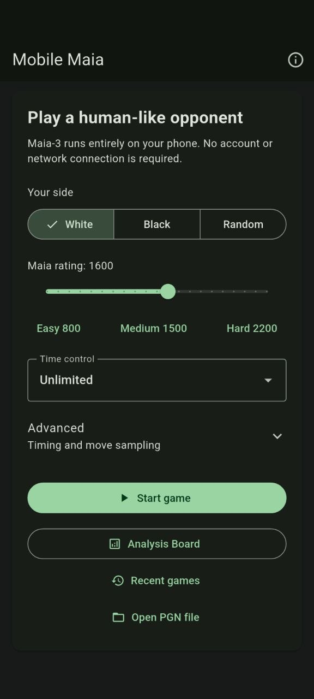
  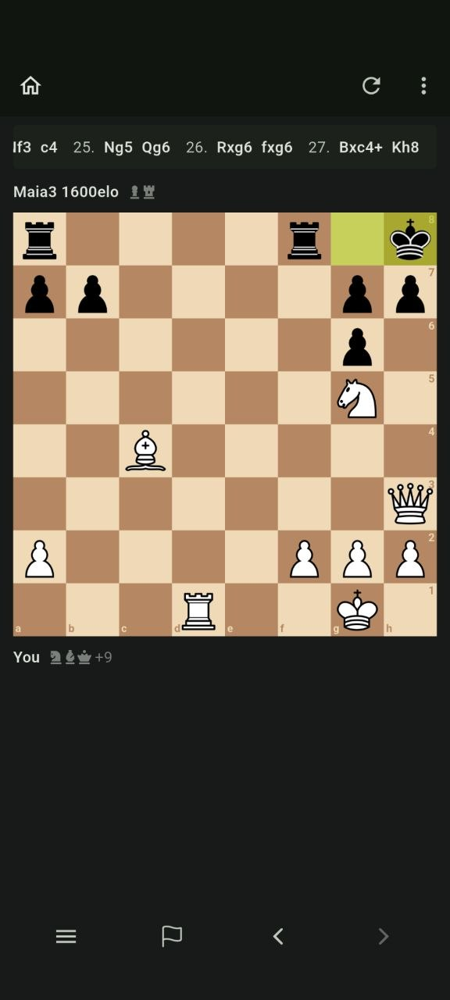
  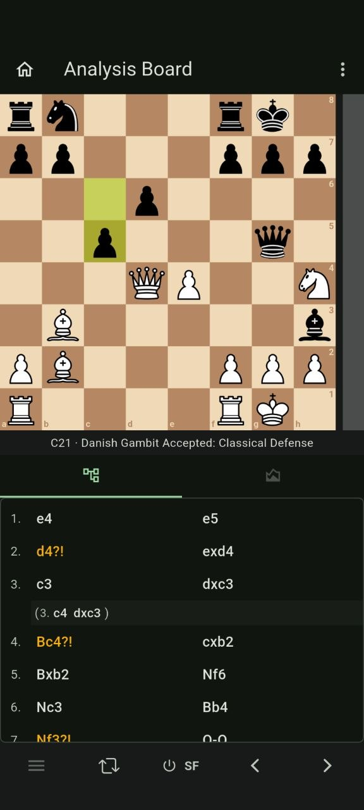
</p>

<p align="center">
  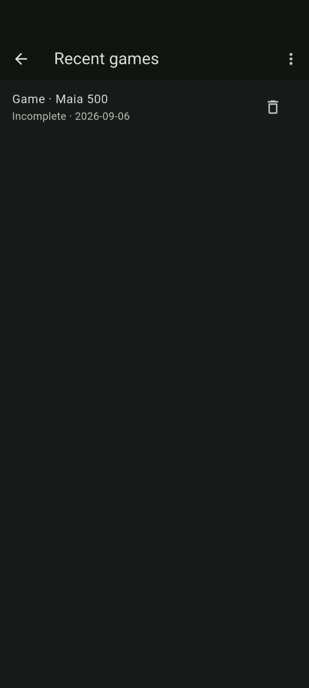
  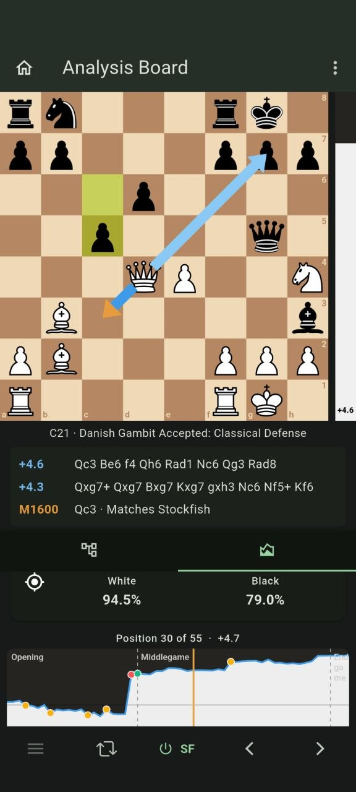
  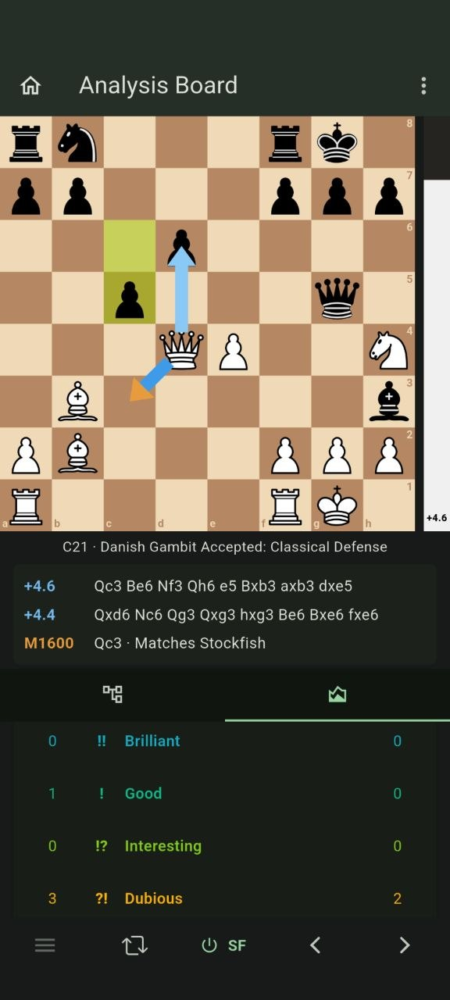
</p>

## User guide

### Analysis Board

Select **Analysis Board** from the home screen to explore a position without
starting a game. Stockfish continuously supplies the evaluation and blue
best-move arrow, while Maia supplies its orange human-move recommendation at
the configured analysis rating.

The bottom actions sheet can load FEN or PGN text, open a PGN file, clear the
move tree, open the graphical board editor, or start a Maia game from the
current position. **Continue from here** lets you choose White, Black, or a
random side and confirms which colour moves next. The top-right menu saves,
shares, or copies the complete PGN, or copies the current FEN.

The board editor follows Lichess's toggle interaction: select a piece and tap
an empty square to add it, or tap the same piece already on the board to remove
it. It also controls side to move and castling rights. The complete Lichess CC0
opening-name dataset is bundled for offline ECO codes, detailed variation
names, and transposition-aware matching.

Select any earlier move and play a different continuation to create an inline,
clickable PGN variation without deleting the existing line. Long-press a move
to delete its continuation; variation moves can also be collapsed, expanded,
promoted one level, or made the main line. Active games,
reviews, complete analysis trees, the selected position, board orientation,
and clock state are checkpointed locally and restored after Android process
death, device restart, or an app update.

<p align="center">
  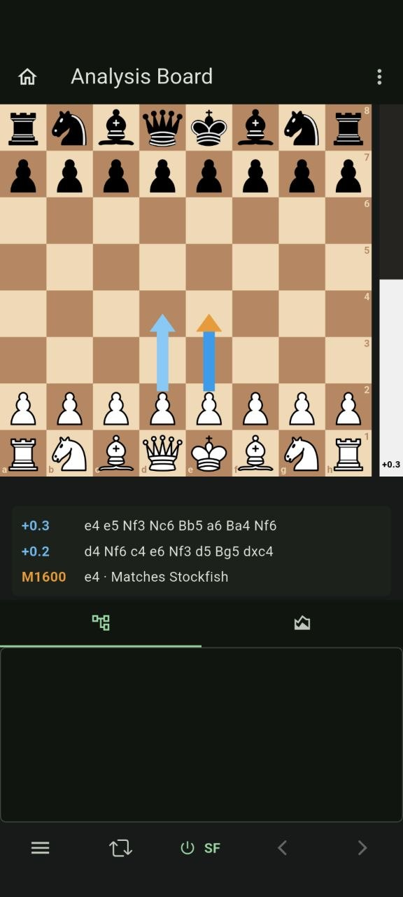
  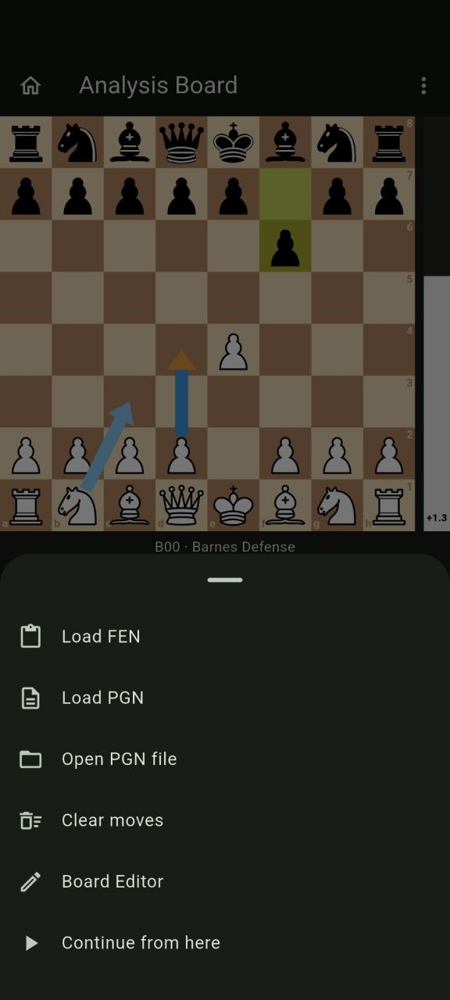
  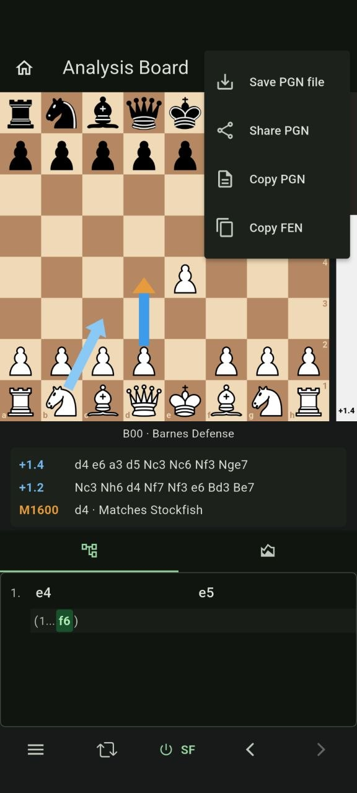
</p>

<p align="center">
  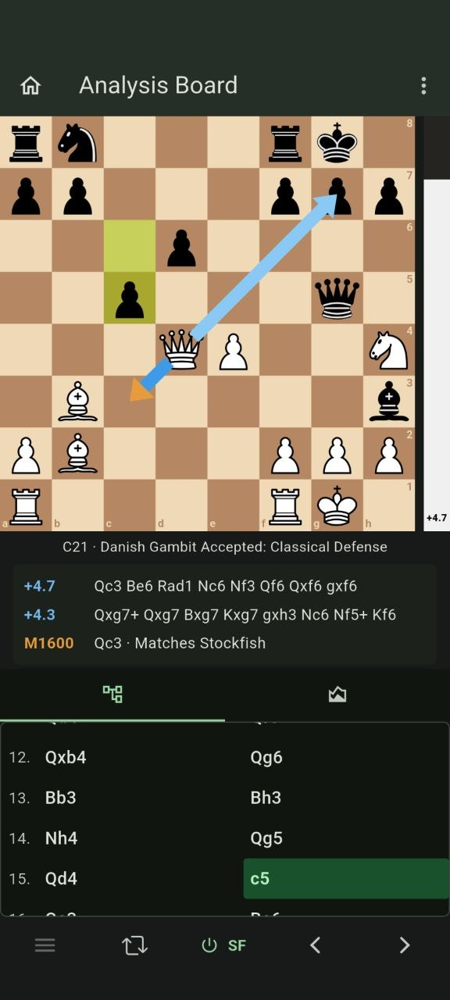
  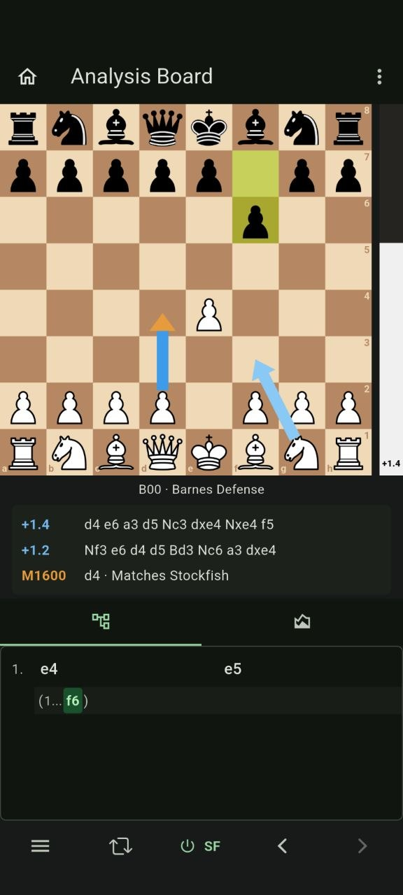
  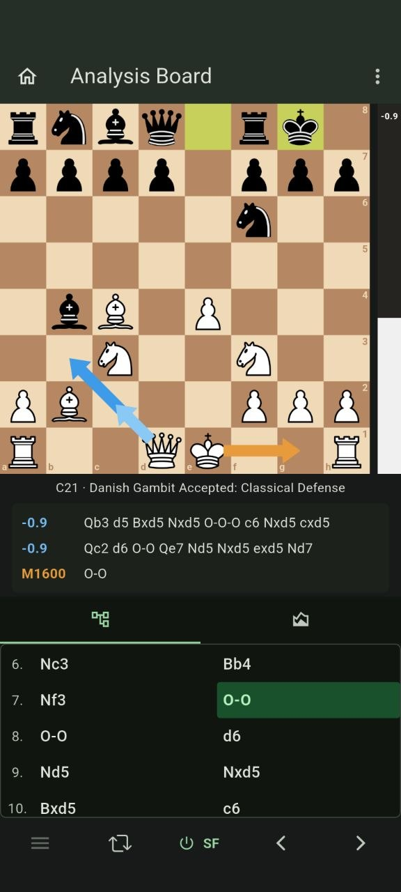
</p>

### Start a game

Choose White, Black, or a random side, set Maia's rating, and select a clock.
Mobile Maia works entirely offline: the Maia-3 model and Stockfish are bundled
with the app, and no account is required. The selected Maia rating is stored
locally and reused the next time the app starts.

<p align="center">
  
  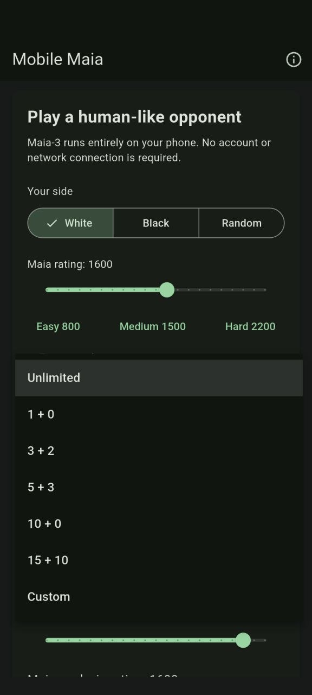
  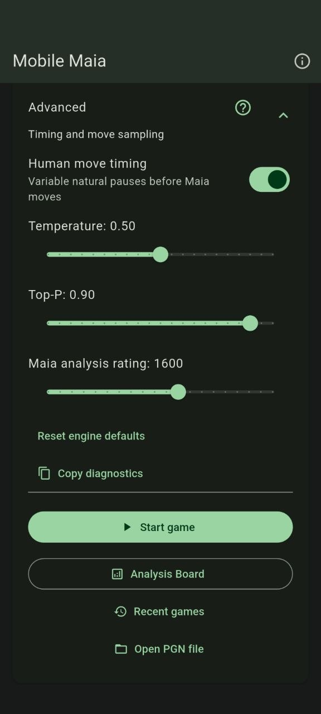
</p>

<p align="center">
  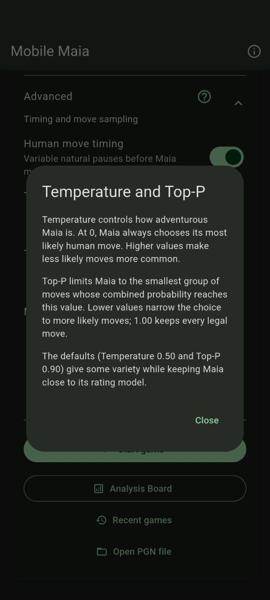
</p>

Advanced settings control human-like move timing, Temperature, Top-P, and the
rating used for Maia's human-move suggestion during review. The default review
rating is 1600. **Copy diagnostics** is also available here if a reproducible
screen error needs investigation.

#### Temperature and Top-P

Maia-3 predicts a probability distribution over the legal moves in each
position. **Temperature** and **Top-P** control how Mobile Maia selects a move
from that distribution; they do not change the model's weights or make Maia
search like Stockfish.

- **Temperature 0** is deterministic: Maia always chooses its
  highest-probability move. Raising Temperature allows progressively more
  variety and gives lower-probability moves a greater chance of being played.
- **Top-P 1.0** keeps the complete legal-move distribution. Lower values keep
  only the most probable moves up to the selected cumulative-probability
  threshold before Maia samples one of them.
- **Mobile Maia's defaults—Temperature 0.5 and Top-P 0.9—**provide human-like
  variety while reducing low-probability outliers. For the most reproducible
  top-choice policy, use Temperature 0 and Top-P 1.0.

These settings are not extra Elo controls. They can change the character and
consistency of play at a given rating, but there is no reliable conversion such
as “lowering Temperature adds 200 Elo.” Keep them fixed while judging which
Maia rating gives you the training experience you want.

For a deeper explanation, see the
[Maia3 local-stack sampling guide](https://github.com/Dash1971/maia3-local-stack#temperature-and-topp).

### Play and take back

Tap or drag pieces to play. The status card shows whose turn it is, while the
material row and move strip update throughout the game. Premoves can be entered
while Maia is thinking. The bottom toolbar opens the game menu, resigns, and
steps backward or forward through played moves. Historical positions are
read-only until you return to the live position. **Takeback** is in the game
menu; it restores the board and clock while retaining the abandoned line as a
variation when the PGN is copied.

<p align="center">
  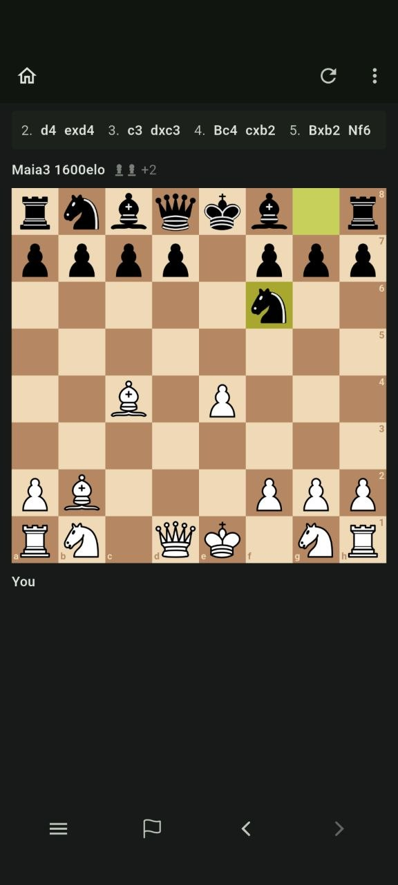
  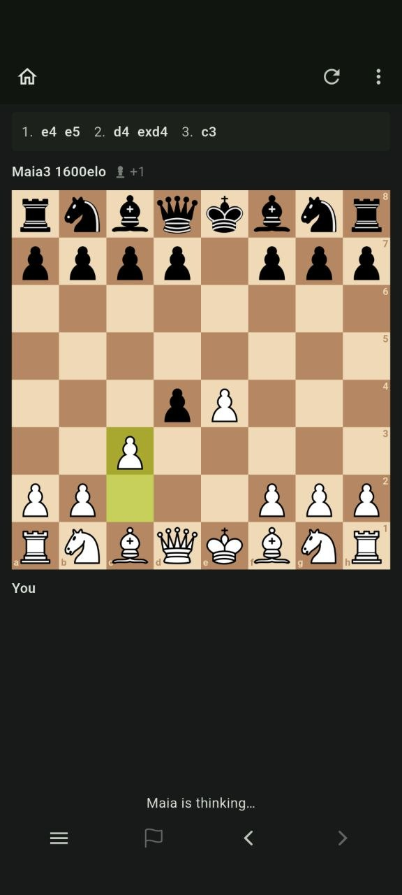
  
</p>

<p align="center">
  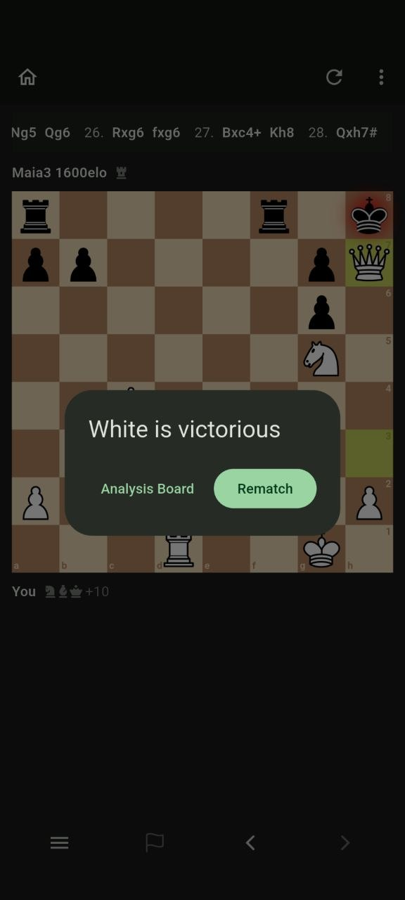
</p>

### Offline games and files

Games and analysis are checkpointed in app-private files, with a previous-good
backup for recovery. **Recent games** contains completed games and incomplete
games explicitly saved with Home. Incomplete games are labelled and become the
same completed record when finished. **Reset game** warns before permanently
removing the current game and starting again.

Recent games supports multi-select, select all, selected deletion, and delete
all. Android may erase app-private data when the app is uninstalled; use
**Save PGN file** or **Share PGN** to keep an independent copy.

<p align="center">
  
</p>

**Open PGN file**, Android's Open with action, and shared PGN attachments import
a single game with its variations, comments, and annotations. Files are limited
to 2 MB and 20,000 moves across all branches. Save and share use Android's
system picker and temporary URI grants; no storage or Internet permission is
required. PGN import uses the first game in a multi-game document.

Training clocks pause while the app is backgrounded, while reviewing the
current game, or after a Maia error. Returning resumes the saved clock; Retry
restarts a failed Maia turn. Analysis stops scheduling engine work offscreen.
Selecting a position gets a short Stockfish search, then a longer refinement if
it remains selected. Full computer analysis uses the longer budget.

### Analysis Board and computer review

After a game, select **Analysis Board**. The board remains fixed at the top
while **Moves** and **Computer** switch the panel below it. Select any move to
jump directly to that position. The evaluation bar and blue arrows show
Stockfish's assessment and leading moves. Maia also suggests the most likely
human move at the configured rating. Agreement between Maia and Stockfish is
shown by a two-tone arrow.

Open **Computer** and run computer analysis to add separate White and Black
accuracy percentages, a tap-to-navigate evaluation graph,
opening/middlegame/endgame separators, and colour-coded Brilliant, Good,
Interesting, Dubious, Mistake, and Blunder move classifications. Analysis can
be stopped safely from the progress screen. The current move's annotation also
appears on the board. Move the pieces from any reviewed position to explore a
branch; analysis is cached for responsive navigation and variations are
retained in exported PGN.

<p align="center">
  
  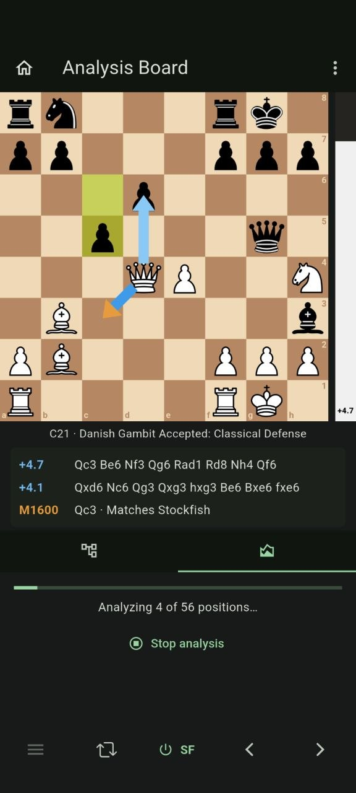
  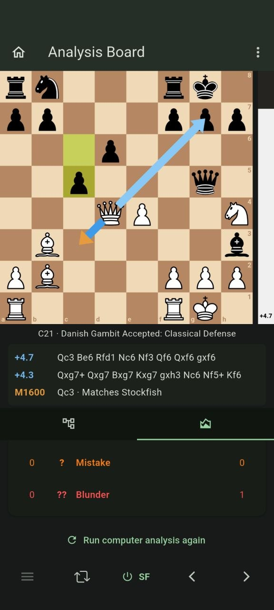
</p>

<p align="center">
  
  
</p>

### About and licensing

The About screen shows the installed version, AGPL-3.0-only terms, warranty
notice, complete source and licence links, and credits for Maia-3, Lichess,
and En Croissant components and adapted code.

<p align="center">
  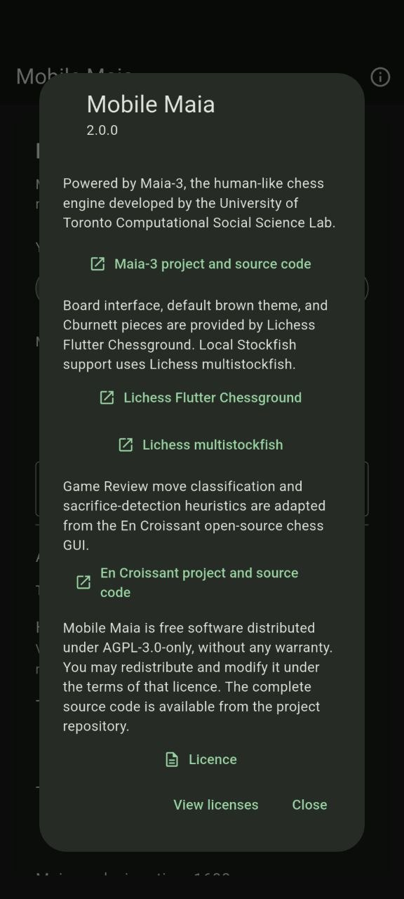
</p>

## MVP features

- Bundled Maia-3 79M model; no account, server, or network connection required
- Offline Analysis Board with Stockfish evaluation and Maia move comparison
- Automatic restoration of active games, reviews, and analysis trees
- FEN/PGN loading, FEN/PGN copying, and graphical position editing
- Play against Maia from the current analysis position
- Complete offline Lichess CC0 opening-name and ECO recognition
- Play as White, Black, or a random side
- Unlimited play by default, Lichess-style clock presets, or custom time and increment
- Easy (800), Medium (1500), Hard (2200), or custom Elo
- Optional human-like move timing with persistent advanced settings
- Premoves while Maia is thinking, with invalid premoves cancelled safely
- Takebacks that restore the previous playable position and clock state while preserving the abandoned line in PGN
- Adjustable Maia Temperature and Top-P from 0 to 1 (defaults 0.5 and 0.9)
- Lichess Chessground board with the default brown theme and Cburnett pieces
- Legal move handling, checkmate/draw detection, move list, and rematches
- Resignation and post-game Home/Rematch actions
- Move-by-move Stockfish and Maia review, starting from the initial position
- Configurable Maia human-move suggestion (default 1600), two Stockfish choices, and two-tone agreement arrows
- Evaluation bar with Lichess-style numeric score and blue Stockfish best-move arrow
- Switchable clickable Moves and Computer graph views below a persistent board
- Optional full-game computer analysis graph with tap-to-navigate positions and game-phase separators
- Brilliant, Good, Interesting, Dubious, Mistake, and Blunder classifications on the graph, move list, and board
- Analysis variations and takebacks preserved as PGN recursive annotation variations
- Long-press variation editing: collapse/expand, promote, make main line, or delete from a move
- Flip-board control during analysis
- Lichess-style material imbalance display, including bishop-versus-knight trades
- Tagged PGN export with players, event, date, result, and termination

## Install and update with Obtainium

[Obtainium](https://github.com/ImranR98/Obtainium) installs Android apps directly
from their official release pages and can notify you when updates are available.

1. Install Obtainium from its
   [official releases page](https://github.com/ImranR98/Obtainium/releases/latest).
2. Open Obtainium, select **Add App**, and paste this URL into **App Source URL**:

   ```text
   https://github.com/Dash1971/maia-chess-android
   ```

3. Confirm that Obtainium detects **GitHub** as the source. Leave
   **Include prereleases** disabled to receive stable versions only.
4. Select **Add**, open **Mobile Maia** in Obtainium, and select
   **Install**.
5. If Android asks, allow Obtainium to install unknown apps, then approve the
   Mobile Maia APK installation.

After setup, use Obtainium's update check to download and install future Maia
Chess releases. Android may ask you to confirm each update.

## Build

Requirements: **Flutter 3.47.1** (pinned in `.fvmrc`), JDK 17, Android SDK 36,
Python 3, and Git LFS. Use the locked dependencies. A GitHub source ZIP contains
an LFS pointer rather than the 316 MB Maia model, so clone with Git LFS:

```sh
git clone https://github.com/Dash1971/maia-chess-android.git
cd maia-chess-android
git lfs install
git lfs pull
python3 tool/verify_model.py
flutter pub get --enforce-lockfile
flutter analyze
flutter test
tool/build_android_release.sh
```

The APK is written to `build/app/outputs/flutter-apk/app-release.apk`. Release
builds intentionally keep readable Dart symbols: Mobile Maia is open source,
readable crash traces are more useful than obfuscation, and deterministic
symbols allow independent reproducibility checks. The script also verifies the
model's exact size and SHA-256 so an incomplete Git LFS checkout cannot silently
produce a broken release. See [`REPRODUCIBLE_BUILDS.md`](REPRODUCIBLE_BUILDS.md).

To check reproducibility, build the **same commit** in two clean directories
with the same pinned toolchain and no signing variables, then compare the
unsigned APKs using `sha256sum`. Retain both hashes with the release notes;
the procedure is not itself evidence that a particular release reproduced.
The manual Checks workflow can build an unsigned APK; pull requests run the
Dart analyzer and regression tests.

Official releases are signed with the dedicated Mobile Maia app-signing key.
The build reads `MOBILE_MAIA_KEYSTORE`, `MOBILE_MAIA_STORE_PASSWORD`, and
`MOBILE_MAIA_KEY_PASSWORD` from the environment; no signing secrets belong in
this repository. When those variables are absent, Gradle produces an unsigned
release suitable for independent F-Droid rebuilding.

The official signing certificate SHA-256 digest is:

```text
cd6c07c4efacf52bcccb83009b522c1dcad4a171197505a486f0a58edb6f172e
```

## Re-export Maia-3

The checked-in ONNX model was exported from the official Maia-3 79M checkpoint.
The exporter verifies ONNX Runtime outputs against PyTorch before succeeding.

```sh
python -m pip install /path/to/maia3 onnx onnxruntime
python tool/export_maia3_onnx.py --model maia3-79m --output assets/models/maia3-79m.onnx
```

## Credits

Mobile Maia uses the
[Maia-3 project](https://github.com/CSSLab/maia3) and its 79M model. Maia-3 was
created by the University of Toronto Computational Social Science Lab to model
human chess move choices at different rating levels. The app includes an About
screen linking directly to the upstream project and source code.

The board interface is provided by
[Lichess Flutter Chessground](https://github.com/lichess-org/flutter-chessground),
including the default Lichess brown theme and Cburnett pieces. Local Stockfish
support uses
[Lichess multistockfish](https://github.com/lichess-org/dart-multistockfish).
Opening names and ECO codes come from the CC0
[Lichess chess-openings dataset](https://github.com/lichess-org/chess-openings),
pinned to the source revision recorded in
[`THIRD_PARTY_NOTICES.md`](THIRD_PARTY_NOTICES.md). The Analysis Board's move
tree, navigation, variation actions, fixed analysis panel, board editor, and
last-move presentation are also informed by the open-source
[Lichess Mobile analysis experience](https://github.com/lichess-org/mobile).
Mobile Maia is independently implemented and is not affiliated with Lichess.

Game Review's move-classification and sacrifice-detection heuristics are
adapted and translated to Dart from
[En Croissant](https://github.com/franciscoBSalgueiro/en-croissant), the
open-source chess GUI by Francisco Salgueiro and contributors. Mobile Maia
retains the upstream classification rules while adding bounded search,
background-isolate execution, and its own review integration. The pinned
upstream revision and licence details are recorded in
[`THIRD_PARTY_NOTICES.md`](THIRD_PARTY_NOTICES.md).

## Licensing

Copyright (c) 2026 Dash. Original application code in this repository is
licensed under the [GNU Affero General Public License v3.0 only](LICENSE)
(`AGPL-3.0-only`). Contributions are accepted under the same licence.

Mobile Maia as a combined application is distributed under AGPL-3.0-only.
Individual third-party components retain their respective
copyright notices and licences, notably Maia-3 (AGPL-3.0),
Stockfish/multistockfish (GPL-3.0), dartchess (GPL-3.0), and adapted
En Croissant code (GPL-3.0). See
[`THIRD_PARTY_NOTICES.md`](THIRD_PARTY_NOTICES.md).

This is an independent community project and is not an official Maia Chess,
University of Toronto CSSLab, Stockfish, Lichess, or En Croissant application.
