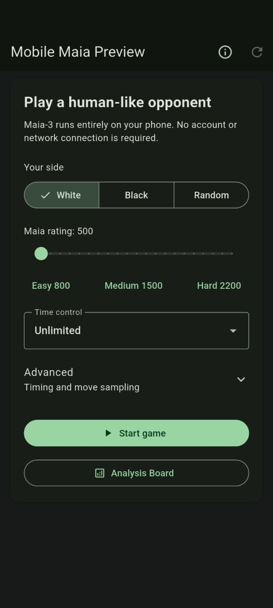
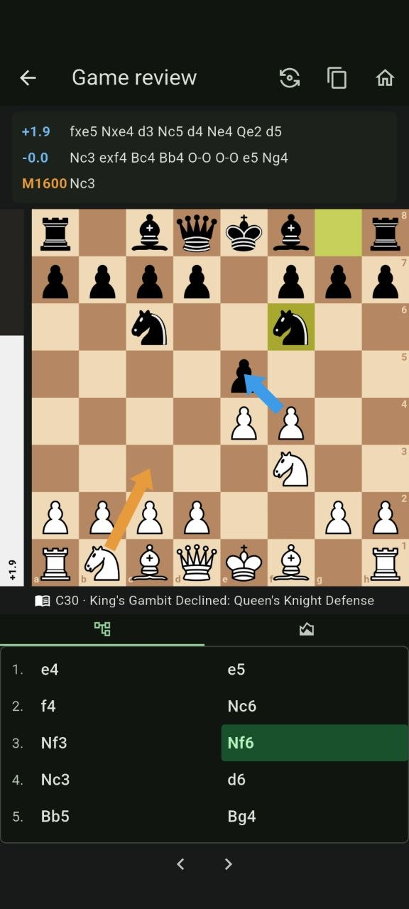
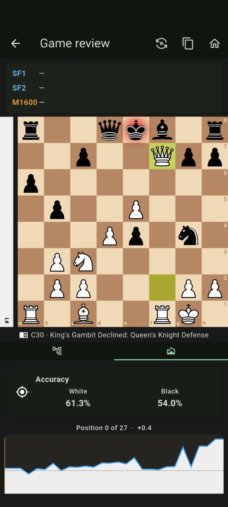
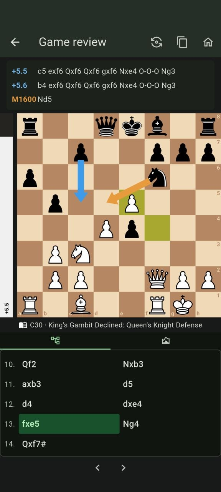
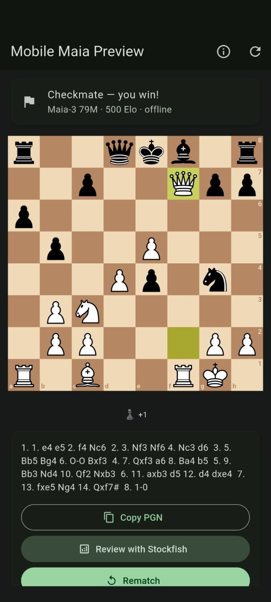
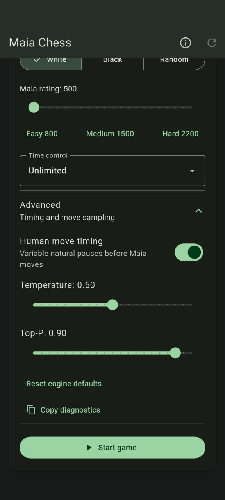
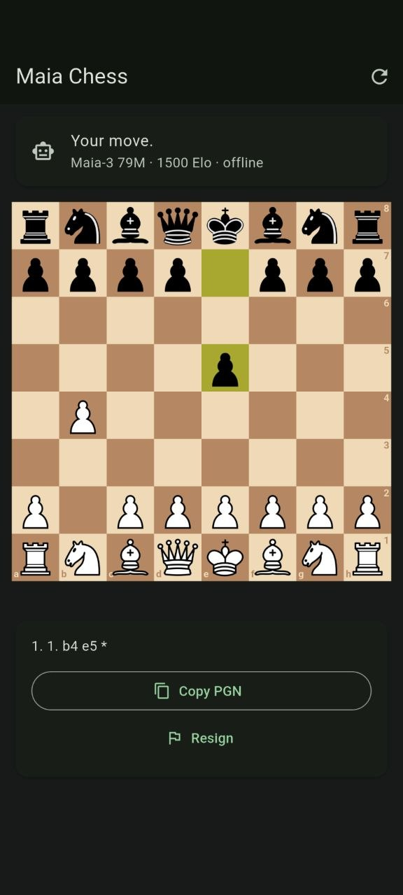
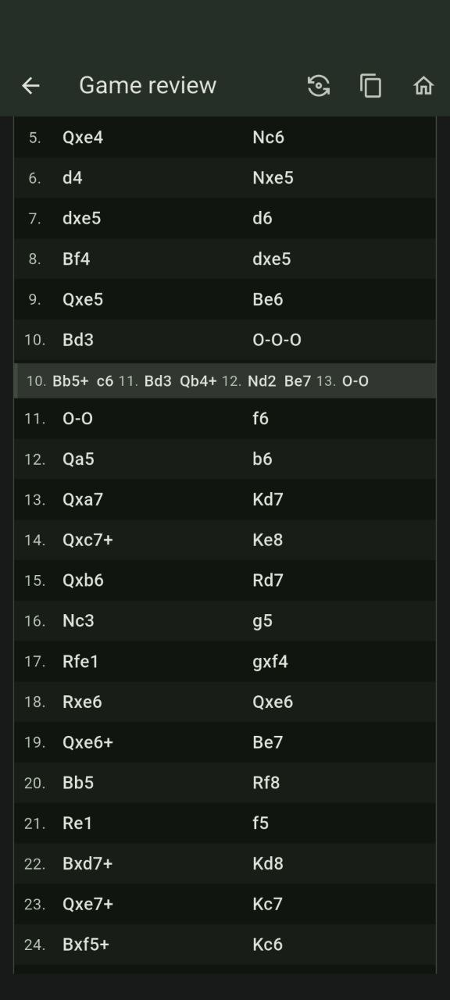
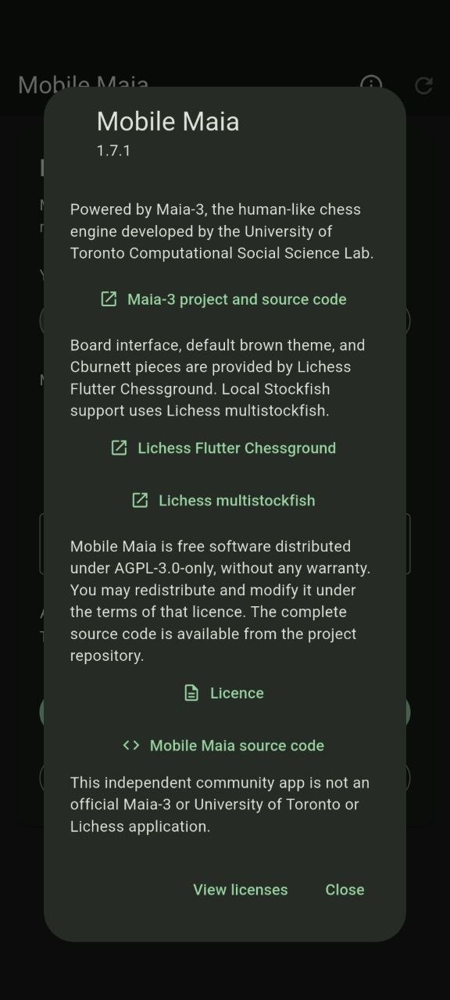

# Mobile Maia

An offline-first Android chess app for playing against Maia-3, reviewing games
with Maia and Stockfish, and exporting PGN.

Built around [Maia-3](https://github.com/CSSLab/maia3), the human-like chess
engine developed by the University of Toronto Computational Social Science Lab.

## Screenshots

<p align="center">
  
  
  
</p>

<p align="center">
  
  
</p>

## User guide

### Analysis Board

Select **Analysis Board** from the home screen to explore a position without
starting a game. Stockfish continuously supplies the evaluation and blue
best-move arrow, while Maia supplies its orange human-move recommendation at
the configured analysis rating.

The actions menu can load FEN or PGN text, copy the current FEN or complete PGN,
open the graphical board editor, or start a Maia game from the current position
as White, Black, or a random side. The board editor follows Lichess's toggle
interaction: select a piece and tap an empty square to add it, or tap the same
piece already on the board to remove it. It also controls side to move and
castling rights. The complete Lichess CC0 opening-name dataset is bundled for
offline ECO codes, detailed variation names, and transposition-aware matching.

Select any earlier move and play a different continuation to create an inline,
clickable PGN variation without deleting the existing line. Long-press a move
to delete its continuation; variation moves can also be collapsed, expanded,
promoted one level, or made the main line. Active games,
reviews, complete analysis trees, the selected position, board orientation,
and clock state are checkpointed locally and restored after Android process
death, device restart, or an app update.

### Start a game

Choose White, Black, or a random side, set Maia's rating, and select a clock.
Mobile Maia works entirely offline: the Maia-3 model and Stockfish are bundled
with the app, and no account is required.

<p align="center">
  
  
</p>

Advanced settings control human-like move timing, Temperature, Top-P, and the
rating used for Maia's human-move suggestion during review. The default review
rating is 1600. **Copy diagnostics** is also available here if a reproducible
screen error needs investigation.

#### Temperature and Top-P

Maia-3 predicts a probability distribution over the legal moves in each
position. **Temperature** and **Top-P** control how Mobile Maia selects a move
from that distribution; they do not change the model's weights or make Maia
search like Stockfish.

- **Temperature 0** is deterministic: Maia always chooses its
  highest-probability move. Raising Temperature allows progressively more
  variety and gives lower-probability moves a greater chance of being played.
- **Top-P 1.0** keeps the complete legal-move distribution. Lower values keep
  only the most probable moves up to the selected cumulative-probability
  threshold before Maia samples one of them.
- **Mobile Maia's defaults—Temperature 0.5 and Top-P 0.9—**provide human-like
  variety while reducing low-probability outliers. For the most reproducible
  top-choice policy, use Temperature 0 and Top-P 1.0.

These settings are not extra Elo controls. They can change the character and
consistency of play at a given rating, but there is no reliable conversion such
as “lowering Temperature adds 200 Elo.” Keep them fixed while judging which
Maia rating gives you the training experience you want.

For a deeper explanation, see the
[Maia3 local-stack sampling guide](https://github.com/Dash1971/maia3-local-stack#temperature-and-topp).

### Play and take back

Tap or drag pieces to play. The status card shows whose turn it is, while the
material row and move list update throughout the game. Premoves can be entered
while Maia is thinking. A takeback restores the board and clock; the abandoned
line is retained as a variation when the PGN is copied.

<p align="center">
  
  
</p>

### Review with Stockfish and Maia

After a game, select **Review with Stockfish**. The board remains fixed at the
top while **Moves** and **Graph** switch the panel below it. Select any move to
jump directly to that position. The evaluation bar and blue arrow show
Stockfish's assessment and best move. Maia also suggests the most likely human
move at the configured rating; when it differs from Stockfish it is shown with
an orange arrow, and when it agrees only the shared blue arrow is shown.

Full-game analysis adds separate White and Black accuracy percentages and a
tap-to-navigate evaluation graph. Move the pieces from any reviewed position to
explore a branch; analysis variations are retained in exported PGN.

<p align="center">
  
  
  
</p>

<p align="center">
  
</p>

### About and licensing

The About screen shows the installed version, AGPL-3.0-only terms, warranty
notice, complete source and licence links, and credits for Maia-3 and Lichess
components.

<p align="center">
  
</p>

## MVP features

- Bundled Maia-3 79M model; no account, server, or network connection required
- Offline Analysis Board with Stockfish evaluation and Maia move comparison
- Automatic restoration of active games, reviews, and analysis trees
- FEN/PGN loading, FEN/PGN copying, and graphical position editing
- Play against Maia from the current analysis position
- Complete offline Lichess CC0 opening-name and ECO recognition
- Play as White, Black, or a random side
- Unlimited play by default, Lichess-style clock presets, or custom time and increment
- Easy (800), Medium (1500), Hard (2200), or custom Elo
- Optional human-like move timing with persistent advanced settings
- Premoves while Maia is thinking, with invalid premoves cancelled safely
- Takebacks that restore the previous playable position and clock state while preserving the abandoned line in PGN
- Adjustable Maia Temperature and Top-P from 0 to 1 (defaults 0.5 and 0.9)
- Lichess Chessground board with the default brown theme and Cburnett pieces
- Legal move handling, checkmate/draw detection, move list, and rematches
- Resignation and post-game Home/Rematch actions
- Move-by-move Stockfish and Maia review, starting from the initial position
- Configurable Maia human-move suggestion (default 1600) with a distinct arrow when it differs from Stockfish
- Evaluation bar with Lichess-style numeric score and blue Stockfish best-move arrow
- Switchable clickable Moves and Computer graph views below a persistent board
- Optional full-game computer analysis graph with tap-to-navigate positions
- Analysis variations and takebacks preserved as PGN recursive annotation variations
- Long-press variation editing: collapse/expand, promote, make main line, or delete from a move
- Flip-board control during analysis
- Lichess-style material imbalance display, including bishop-versus-knight trades
- Tagged PGN export with players, event, date, result, and termination

## Install and update with Obtainium

[Obtainium](https://github.com/ImranR98/Obtainium) installs Android apps directly
from their official release pages and can notify you when updates are available.

1. Install Obtainium from its
   [official releases page](https://github.com/ImranR98/Obtainium/releases/latest).
2. Open Obtainium, select **Add App**, and paste this URL into **App Source URL**:

   ```text
   https://github.com/Dash1971/maia-chess-android
   ```

3. Confirm that Obtainium detects **GitHub** as the source. Leave
   **Include prereleases** disabled to receive stable versions only.
4. Select **Add**, open **Mobile Maia** in Obtainium, and select
   **Install**.
5. If Android asks, allow Obtainium to install unknown apps, then approve the
   Mobile Maia APK installation.

After setup, use Obtainium's update check to download and install future Maia
Chess releases. Android may ask you to confirm each update.

## Build

Requirements: Flutter 3.47+, JDK 17, and Android SDK 36.

```sh
flutter pub get
flutter analyze
flutter test
tool/build_android_release.sh
```

The APK is written to `build/app/outputs/flutter-apk/app-release.apk`. Release
builds intentionally keep readable Dart symbols: Mobile Maia is open source,
readable crash traces are more useful than obfuscation, and deterministic
symbols allow independent reproducibility checks. See
[`REPRODUCIBLE_BUILDS.md`](REPRODUCIBLE_BUILDS.md).

Official releases are signed with the dedicated Mobile Maia app-signing key.
The build reads `MOBILE_MAIA_KEYSTORE`, `MOBILE_MAIA_STORE_PASSWORD`, and
`MOBILE_MAIA_KEY_PASSWORD` from the environment; no signing secrets belong in
this repository. When those variables are absent, Gradle produces an unsigned
release suitable for independent F-Droid rebuilding.

The official signing certificate SHA-256 digest is:

```text
cd6c07c4efacf52bcccb83009b522c1dcad4a171197505a486f0a58edb6f172e
```

## Re-export Maia-3

The checked-in ONNX model was exported from the official Maia-3 79M checkpoint.
The exporter verifies ONNX Runtime outputs against PyTorch before succeeding.

```sh
python -m pip install /path/to/maia3 onnx onnxruntime
python tool/export_maia3_onnx.py --model maia3-79m --output assets/models/maia3-79m.onnx
```

## Credits

Mobile Maia uses the
[Maia-3 project](https://github.com/CSSLab/maia3) and its 79M model. Maia-3 was
created by the University of Toronto Computational Social Science Lab to model
human chess move choices at different rating levels. The app includes an About
screen linking directly to the upstream project and source code.

The board interface is provided by
[Lichess Flutter Chessground](https://github.com/lichess-org/flutter-chessground),
including the default Lichess brown theme and Cburnett pieces. Local Stockfish
support uses
[Lichess multistockfish](https://github.com/lichess-org/dart-multistockfish).
Opening names and ECO codes come from the CC0
[Lichess chess-openings dataset](https://github.com/lichess-org/chess-openings),
pinned to the source revision recorded in
[`THIRD_PARTY_NOTICES.md`](THIRD_PARTY_NOTICES.md). The Analysis Board's move
tree, navigation, variation actions, fixed analysis panel, board editor, and
last-move presentation are also informed by the open-source
[Lichess Mobile analysis experience](https://github.com/lichess-org/mobile).
Mobile Maia is independently implemented and is not affiliated with Lichess.

## Licensing

Copyright (c) 2026 Dash. Original application code in this repository is
licensed under the [GNU Affero General Public License v3.0 only](LICENSE)
(`AGPL-3.0-only`). Contributions are accepted under the same licence.

Mobile Maia as a combined application is distributed under AGPL-3.0-only.
Individual third-party components retain their respective copyright notices
and licences, notably Maia-3 (AGPL-3.0), Stockfish/multistockfish (GPL-3.0), and
dartchess (GPL-3.0). See [`THIRD_PARTY_NOTICES.md`](THIRD_PARTY_NOTICES.md).

This is an independent community project and is not an official Maia Chess,
University of Toronto CSSLab, Stockfish, or Lichess application.
