# Mobile Maia

Mobile Maia is a free, open-source Android chess app for playing against the
human-like [Maia-3](https://github.com/CSSLab/maia3) model and reviewing games
with Maia and Stockfish. The model, engines, opening data, games, and analysis
all stay on the phone and work without an account or Internet connection.

Choose a Maia level from 600 to 2600, compare the move a person is likely to
play with Stockfish's best move, or run a complete game review without a daily
quota. Mobile Maia is an independent community project released under
AGPL-3.0-only.

Download the latest Stable APK from
[GitHub releases](https://github.com/Dash1971/maia-chess-android/releases/latest).
The [official F-Droid package page](https://f-droid.org/packages/com.dash1971.maia_chess/)
also provides updates after its separate reproducible-build process completes.

## Mobile Maia 2.3

Version 2.3 adds:

- **Ten interface languages:** English, Japanese, Simplified Chinese, Korean,
  Spanish, German, French, Russian, Hindi and Brazilian Portuguese. Follow the
  device language or choose one in Settings; the choice is remembered locally.
- **A clearer game library:** Recent games keeps the original played date and
  chronological order when you open or analyse a game. Only the result is
  coloured: green for your win, red for your loss, amber for a draw and muted
  blue for an unfinished game.
- **The complete Lichess-style quick controls:** 1+0, 2+1, 3+0, 3+2, 5+0, 5+3,
  10+0, 10+5, 15+10, 30+0 and 30+20, alongside Unlimited and Custom. The same
  choices are available in Continue from here.
- **Quicker optional human timing for short games:** 1+0 averages about one
  second per move; 2+1, 3+0 and 3+2 average about 1.5 seconds. Longer controls
  retain the existing rhythm. Calculation time counts toward these targets.

The Maia-3 79M model, Stockfish 19 Light and established engine settings are
unchanged. Existing games and valid preferences are preserved. See the
[2.3 release notes](docs/release-notes/v2.3.0.md).

Version 2.2 added two Maia analysis perspectives, game sounds and haptics,
stronger review and recovery, and Continue from here setup. New games default
to **Temperature 1.00 / Top-P 1.00**; valid saved choices are preserved. The
[sampling report](docs/research/maia3-sampling/REPORT.md) explains the
strength-versus-variety tradeoff. Earlier changes are documented in the
[2.2 notes](docs/release-notes/v2.2.0.md) and
[2.1 notes](docs/release-notes/v2.1.0.md).

Active development continues in the separate
[Mobile Maia Preview repository](https://github.com/Dash1971/maia-chess-android-preview).
Its gold-icon app has a separate Android package and can be installed beside
this stable blue-icon app.

## Feature guide

The refreshed 2.3 Home, Settings, clock-menu and Recent Games images below are
renders of the actual Flutter screens (sample records in Recent Games), not
Android APK qualification evidence. Unchanged board/review screenshots are
retained from earlier Stable releases. See [capture provenance](docs/release-notes/v2.3.0.md#screenshots).

### Choose a game or analysis workflow

<p align="center">
  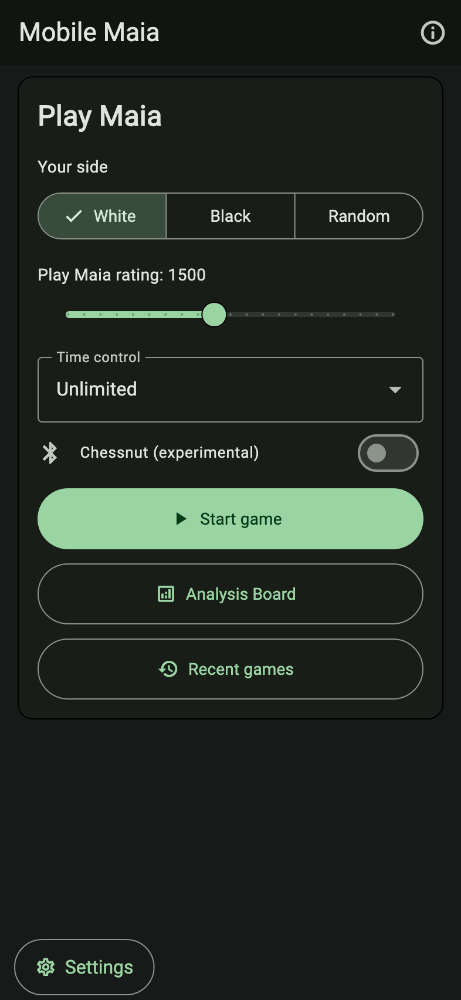
</p>

The home screen is the starting point for every workflow. Play as White, Black,
or a random side; choose a preset or custom **Play Maia rating**; then start a game.
**Analysis Board** opens a free-form position, **Recent games** restores saved
work, and PGN files can be imported through Analysis Board or Android's Open
with action. Your side, rating, clock, custom time values, and advanced settings
are remembered locally.

### Time controls

<p align="center">
  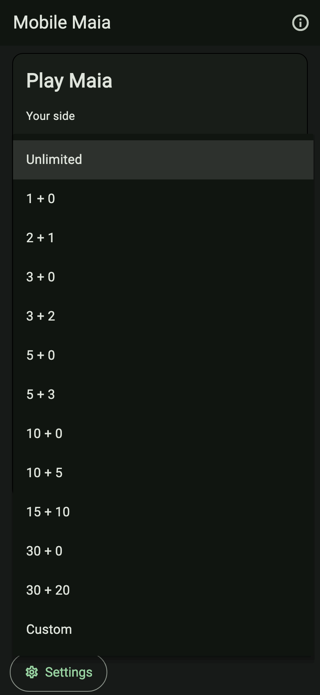
</p>

Games are unlimited by default. The quick controls follow Lichess's order:
**1+0, 2+1, 3+0, 3+2, 5+0, 5+3, 10+0, 10+5, 15+10, 30+0, 30+20**.
The first number is minutes per player; the second is seconds added after each
move. Custom minutes and increment are also available. Training clocks pause while the app is in the
background, while you review the current game, or after an engine error. Timed
PGNs use a standard `TimeControl` header and per-move `[%clk ...]` comments to
millisecond precision; unlimited games do not invent clock data.

### Human move timing

Human move timing is optional and off by default. When enabled, Maia varies
its pauses to give games a more natural rhythm. Shorter pauses are more common
than longer ones. The configured time control selects the timing automatically:

| Time control | Average move-time target | Maximum target |
| --- | --- | --- |
| 1+0 | About 1 second | 3 seconds |
| 2+1, 3+0, 3+2 | About 1.5 seconds | 4.5 seconds |
| 5+0 and longer presets; Unlimited | About 2 seconds | About 9 seconds |

The default draw is normally 0.55–4.5 seconds, with a 6% chance of an additional
1.5–4.5 seconds. Faster tiers scale that whole sample and then cap it. Matching
Custom controls use the same faster tiers; other Custom controls keep the
original distribution. These are random pauses, not a measure of position
difficulty, and they do not shorten automatically when the remaining clock is low.

Calculation time counts toward the target. If the move is ready after 0.2
seconds and the target is 1.8 seconds, the app waits another 1.6 seconds. If
calculation already takes 2.3 seconds, it adds no extra wait. Actual times can
therefore exceed the target, and timed games can still end on the clock.

### Interface language

<p align="center">
  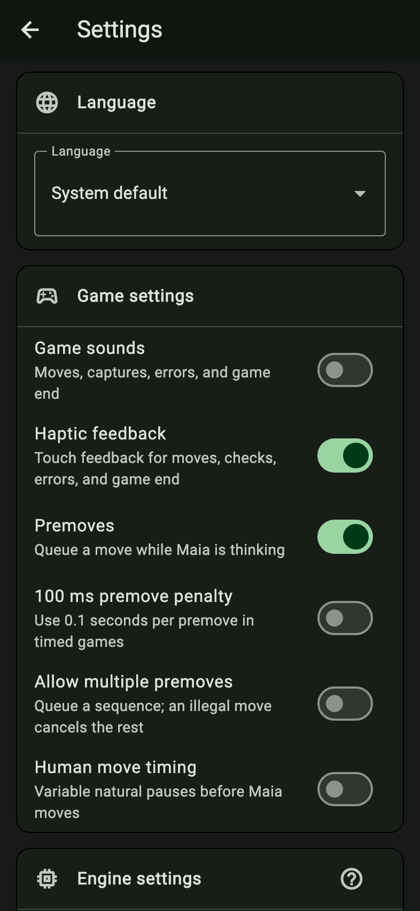
</p>

Open **Settings → Language** to follow the system or select English, 日本語,
简体中文, 한국어, Español, Deutsch, Français, Русский, हिन्दी or Português (Brasil).
Languages are listed by their native names. Switching updates the interface
without rewriting PGN notation, historical game data or engine values.
Unsupported device languages fall back to English; Simplified Chinese is not
silently substituted for a Traditional Chinese system preference.

### Advanced play and review settings

<p align="center">
  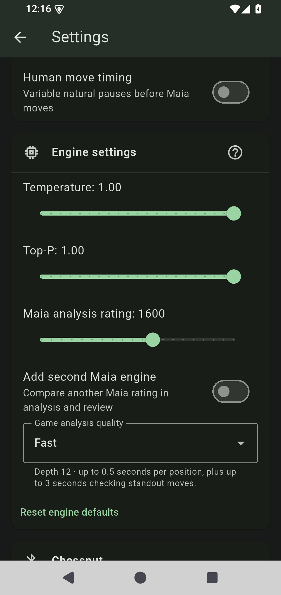
</p>

Advanced settings control premoves, an optional exact 100 ms premove charge,
multiple queued premoves, human-like Maia timing, Temperature, Top-P, the Maia
rating used during review, an optional **second Maia engine** at another rating,
and full-game analysis quality. This example compares Maia 1600 and Maia 2400:

<p align="center">
  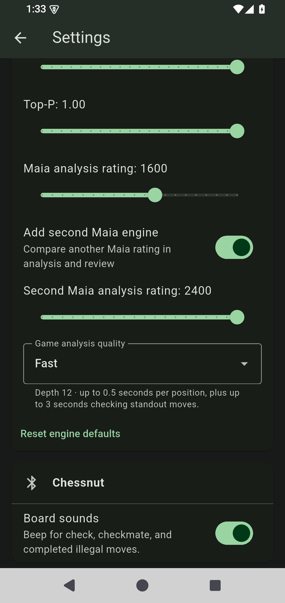
</p>

**Fast** is the new-game and reset default; **Balanced** and **Thorough** offer deeper
Stockfish searches. Existing saved quality choices are preserved. An inline
reminder appears when either sampling control differs from 1.00; the
information button explains the tradeoff and links to the research report.
**Copy diagnostics** creates a privacy-safe local report
for troubleshooting and never uploads it automatically.

### Maia sampling

Maia predicts how often human players would choose each legal move. **Temperature** changes how strongly it favors its most likely moves; **Top-P** cuts off less likely choices.

We recommend **Temperature 1.0 / Top-P 1.0** for a varied opening repertoire. At the 1600 setting, Maia's first moves were about **64% e4, 25% d4 and 11% other moves**, close to the Lichess blitz sample we compared it with. Lower settings made Maia stronger, but removed some openings and sidelines.

We also tested **1.0 / 0.95**: it gained about **71 Elo** against 1/1 in 1,200 games, while producing **67 opening families rather than 85** in equal samples of 2,000 openings. It is a useful stronger option; we chose 1/1 to keep the wider repertoire.

The previous **0.5 / 0.9** settings came from our [Maia2](https://github.com/Dash1971/maia2-local-stack) and [Maia3](https://github.com/Dash1971/maia3-local-stack) local stacks, which used opening books to supply variety. Mobile Maia has no opening book, so we now favor variety in Maia's own choices, accepting the reduction in playing strength.

[See the visual report, results and reproducible data](docs/research/maia3-sampling/REPORT.md).

### Why move-history input is off

Mobile Maia supplies the current position to Maia rather than the preceding
positions, to reduce repetitive copying in low-Elo openings. In our Stonewall
test at 600, after `1.d4 d5 2.e3 e6 3.Bd3 Bd6`, history raised the probability
of copying all five next moves through castling from **0.0084% to 34.2%**.

History also improved average human-move prediction, so this is a gameplay
tradeoff, not a claim that disabling it makes Maia stronger. It is our design
decision; upstream supports optional history and defaults it off, but we found
no explicit recommendation against using it.
[Read the research, limitations and reproducible results](docs/research/maia3-history/REPORT.md).

### Play against a human-like opponent

<p align="center">
  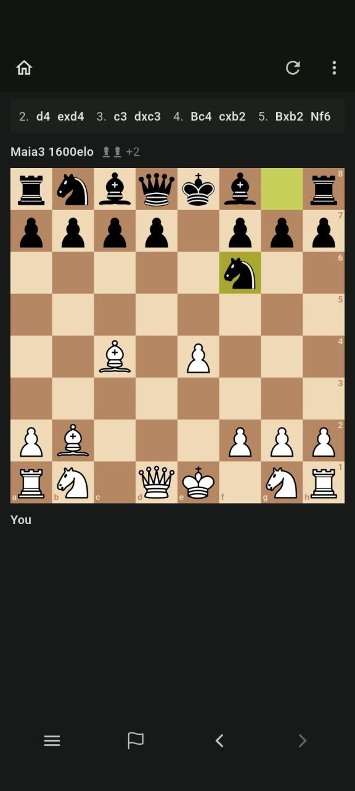
</p>

Tap or drag pieces on the Lichess Chessground board. Maia-3 runs on-device and
selects moves for the chosen rating instead of behaving like a deliberately
weakened tactical engine. The live view shows both players, clocks, material
imbalance, the move strip, turn status, and game controls. The screen stays
awake during an active game, and the current position is checkpointed for
recovery after process death, restart, or an app update.

### Game sounds and haptics

<p align="center">
  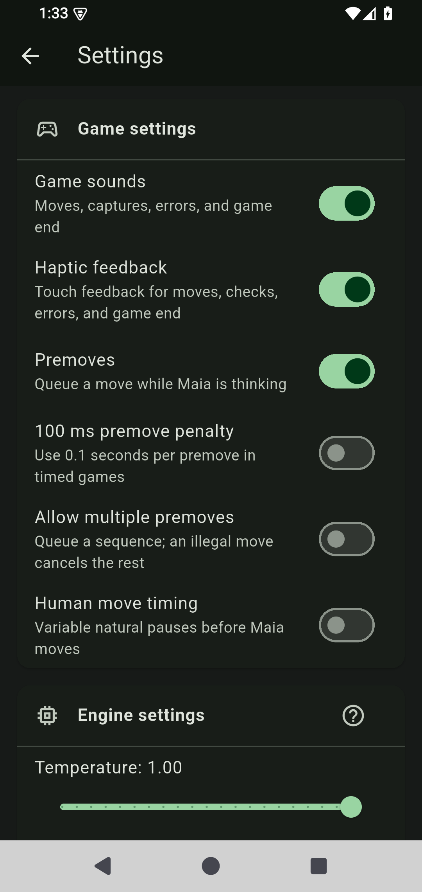
</p>

Optional **Game sounds** distinguish moves, captures, invalid moves,
and game end. **Touch feedback** adds touch cues for moves, checks, errors,
and game end. Both run on the phone without a network connection. Phone
feedback is suppressed while a Chessnut board controls the game; the separate
**Board sounds** setting controls its own audible cues.

### Multiple premoves

<p align="center">
  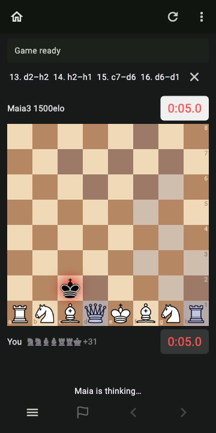
</p>

Inspired by GM Aman Hambleton's
[“Mona Lisa” checkmate](https://www.chess.com/article/view/how-to-replicate-the-mona-lisa-checkmate),
this example queues a sixteen-move rook-and-queen plan. The strip is scrolled to
moves 13–16 and the projected board shows the signature finish: White's army
reset on its back rank with `Qd1#`. Mobile Maia previews only the player's
queued moves, not the opponent king's forced walk, so this is an homage rather
than a move-for-move reconstruction.

Enable **Allow multiple premoves** to plan up to 64 moves while Maia is
thinking. After each Maia reply, only the next premove runs, and only if it is
legal in the actual position; an illegal move cancels everything that follows.
**Cancel premoves** clears the sequence immediately.

Premoves are available only for on-screen games. A separate setting can charge
exactly 0.1 seconds for each executed premove before applying the normal
increment. Without that setting, the default is one Lichess-style premove with
no fixed deduction. Navigation, takebacks, leaving or restarting the game, and
game completion all clear the queue.

### Navigation, takebacks, resignation, and draw offers

<p align="center">
  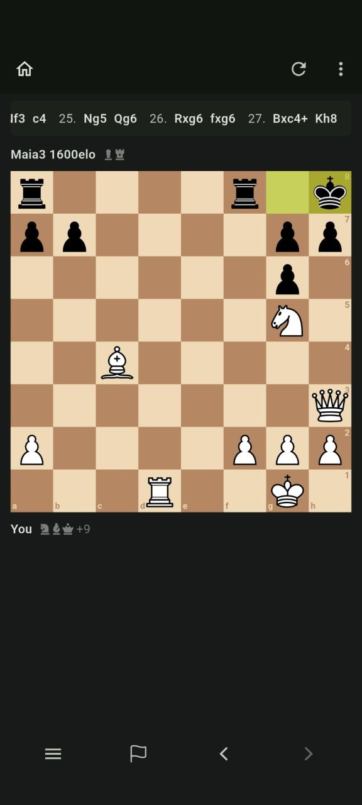
</p>

The bottom toolbar opens game actions, resigns, and moves backward or forward
through played positions. Hold Back to jump to the starting position and hold
Forward to return to the latest position. Historical positions are read-only;
completed games also show the clock values belonging to the selected ply.

**Takeback** restores the playable board and clock while preserving the
abandoned continuation as a PGN variation. In sufficiently reduced endgames,
**Offer draw** asks for confirmation and lets local Stockfish decide whether
Maia accepts. Accepted offers are saved as draws by agreement.

### Game completion and rematches

<p align="center">
  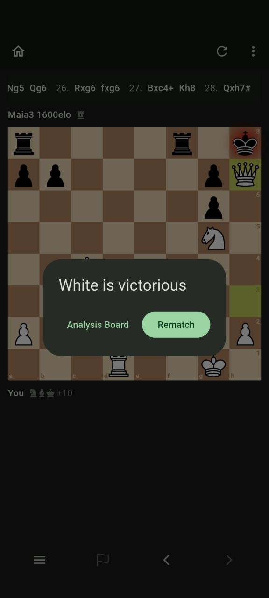
</p>

Checkmate, stalemate, timeout, resignation, and agreed draws produce a result
dialog. Open the finished position in **Analysis Board**, start a **Rematch**,
or return Home. A completed game remains in **Recent games** when you choose
**New game**; resetting an unfinished game uses a separate destructive
confirmation.

### Chessnut electronic-board play

<p align="center">
  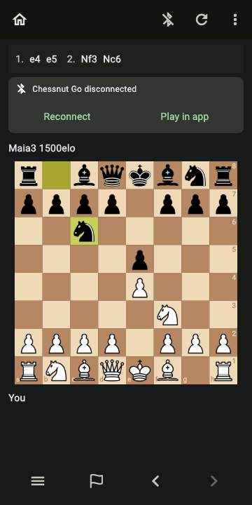
</p>

Experimental Chessnut support has been confirmed with both Chessnut Go and
Chessnut Air. It enters physical moves over Bluetooth and lights Maia's reply
on the board. Mobile Maia compares the complete sensed position, treats
temporary piece lifts and partial castling as unfinished, and lights mismatched
squares when correction is needed. Optional board sounds distinguish check,
checkmate, and a complete-looking illegal move.

Reconnect keeps the game and verifies the physical position before play
continues. Pending Maia and takeback lights are restored. **Play in app** moves
the same unfinished game to on-screen input while retaining its moves,
variations, rating, and orientation. Version 2.1 targets untimed games from the
standard starting position. The physical board's **New** button currently has
no effect in Mobile Maia. Other Chessnut models may use the same protocol but
have not yet been confirmed; compatibility reports from their users are
welcome. Timed board games, USB, and Analysis Board input are not yet supported.

### Analysis Board

<p align="center">
  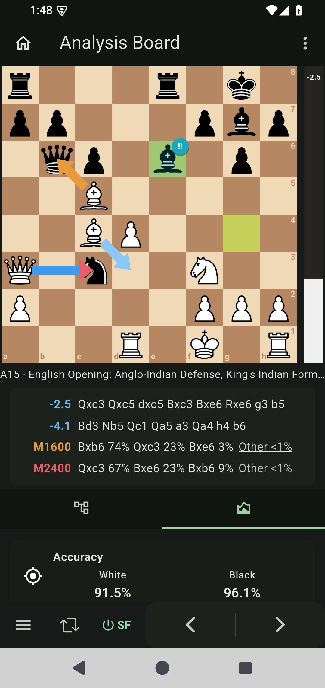
</p>

Use **Analysis Board** to explore without starting a game. Stockfish supplies
two evaluated lines and blue best-move arrows. Maia supplies the move a person
at the configured rating is most likely to play; turn on the second Maia engine
to compare two ratings and probabilities side by side. The screen can show all
four lines together. When engines choose the same move, their arrows overlap or
combine. The board, move tree, selected position, orientation, and engine
context are restored across restarts.

### Move list, opening names, and engine lines

<p align="center">
  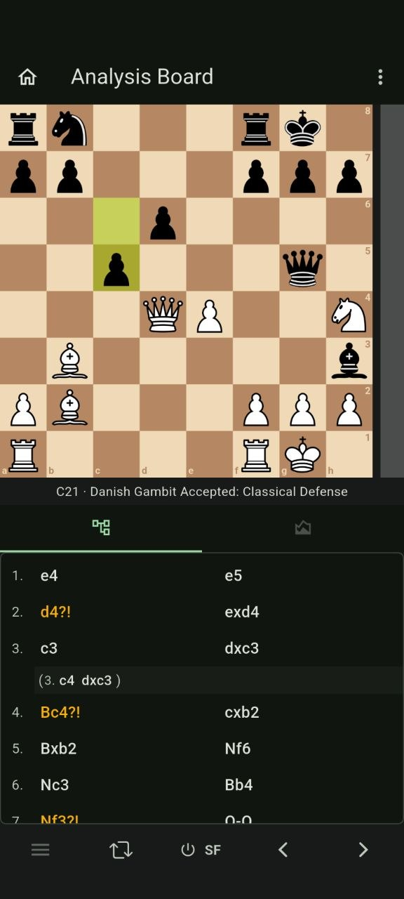
</p>

The fixed board sits above a scrollable, clickable move list. Select any move
to inspect that position, use the arrows one ply at a time, or hold them to
jump to the beginning or end of the main line. The bundled Lichess CC0 opening
dataset supplies offline ECO codes, detailed variation names, and
transposition-aware matching. Interactive Stockfish analysis first returns a
quick result and then refines the same selected position.

### Why Stockfish 19 Light?

Mobile Maia bundles Stockfish 19 Light through Lichess multistockfish 0.6.1.
The move from the older Stockfish 16 integration followed a reproducible native
crash when an engine was stopped and restarted. The package upgrade and
per-engine handle lifecycle addressed that crash; choosing Light also keeps a
small NNUE in the app so analysis and full-game review work immediately and
entirely offline, without a separate download or setup. Bundling a full NNUE
for everyone would increase the app's download and storage footprint. Light
remains the default and offline fallback. An explicitly opt-in full Stockfish 19
NNUE is a separate proposal, subject to quality, device-performance, storage,
file-integrity, privacy, reproducibility, and F-Droid checks
([Preview issue #52](https://github.com/Dash1971/maia-chess-android-preview/issues/52)).

### Load, edit, continue, and clear positions

<p align="center">
  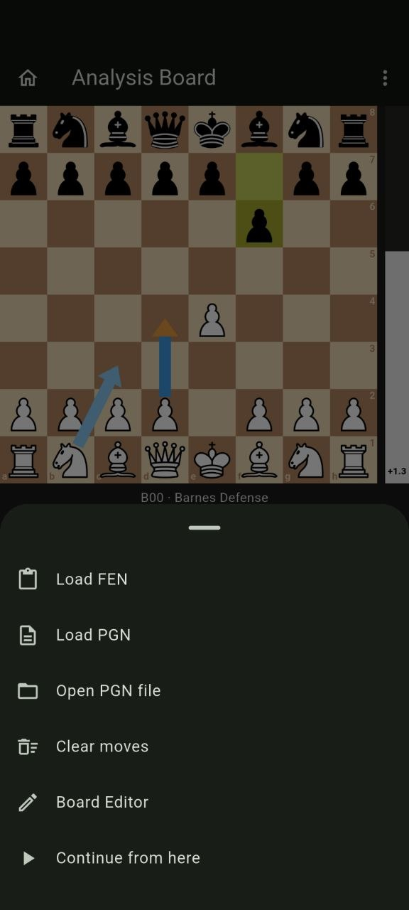
</p>

The actions sheet loads FEN or PGN text, opens a PGN file, clears the move tree,
opens the graphical board editor, or starts a Maia game from the current
position. **Continue from here** opens a one-game setup dialog for side, Play
Maia rating, and clock, including custom minutes and increment. It begins with
your saved Home choices, but changes in the dialog do not overwrite them; the
dialog also confirms whose turn it is.

<p align="center">
  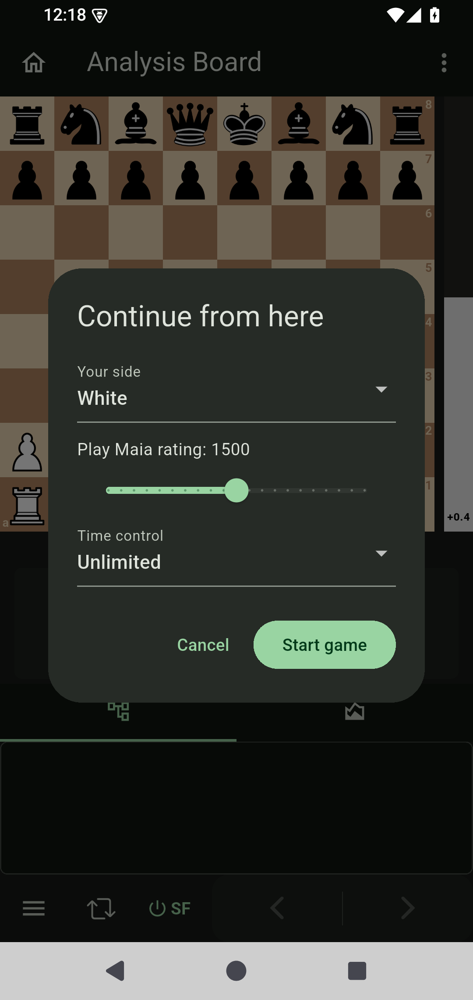
</p>

In the editor, select a piece and tap a square to add it, or tap the same
piece on the board to remove it; side to move and
castling rights are editable too.

### Save and share analysis

<p align="center">
  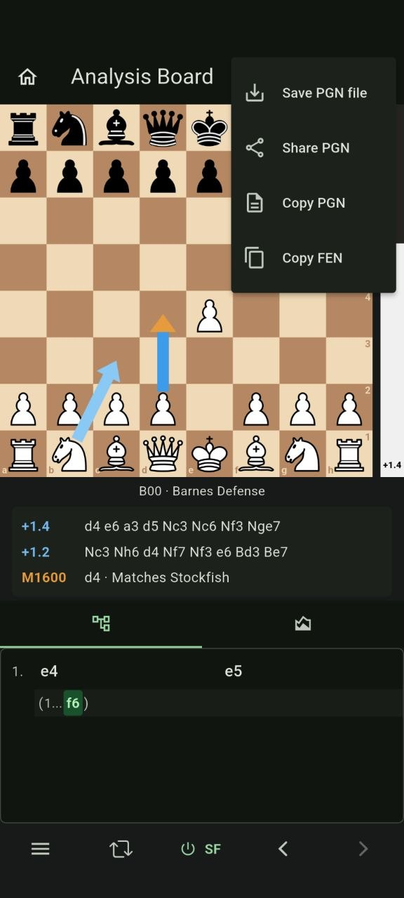
</p>

The top menu saves or shares the complete annotated PGN, copies it to the
clipboard, or copies the current FEN. Android's system picker and temporary URI
grants are used, so storage and Internet permissions are not required.

### Build and edit variations

<p align="center">
  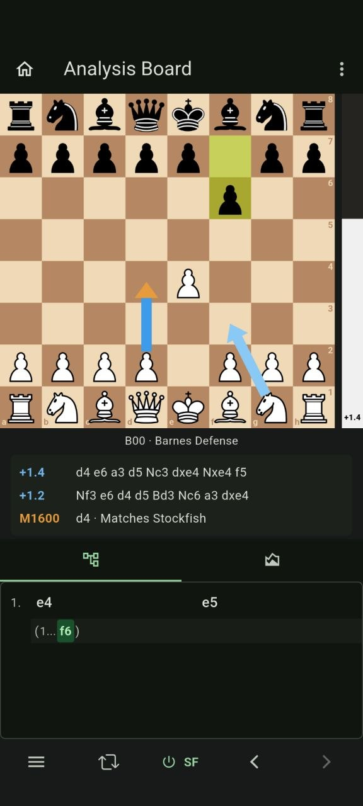
</p>

Select an earlier move and play a different continuation to create a clickable
inline variation without deleting the original line. Long-press a move to
collapse or expand its continuation, promote it one level, make it the main
line, or delete from that point. Back navigation exits a variation at its branch
point before continuing toward the start. Variations, comments, annotations,
and takeback lines remain in exported PGN.

### Full-game computer analysis

<p align="center">
  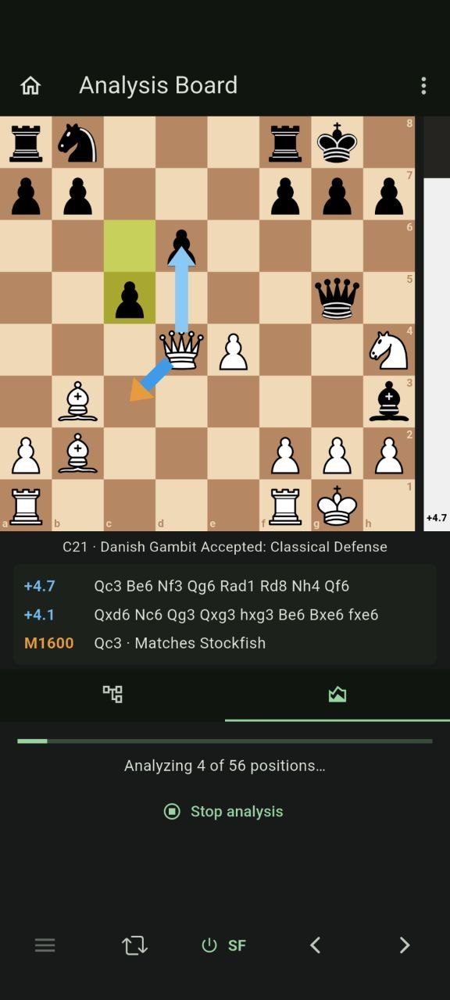
</p>

From a completed or imported game, open **Computer** and run a full review.
Stockfish analyses every main-line position locally using the selected Fast,
Balanced, or Thorough preset. Progress is visible and cancellation is safe;
there is no server-side quota.

### Accuracy and game phases

<p align="center">
  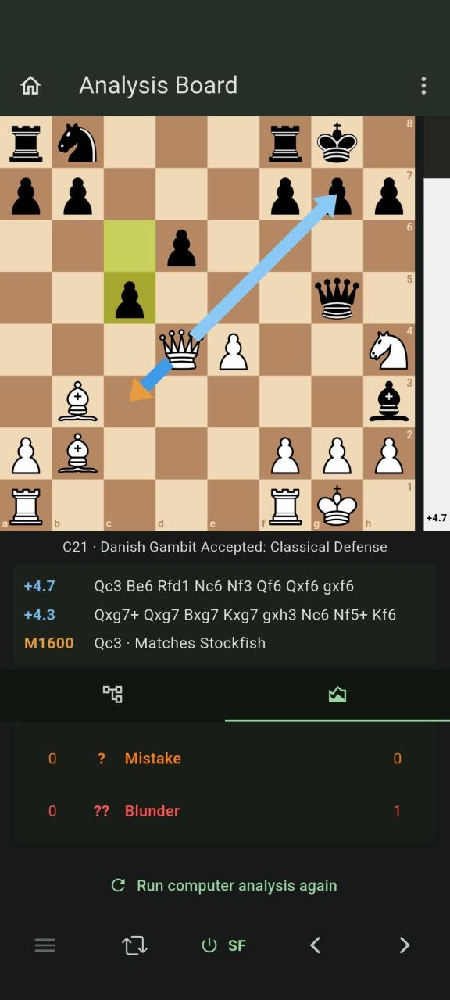
</p>

The completed review reports separate White and Black accuracy, move totals,
and opening, middlegame, and endgame sections. Maia's likely human move remains
available beside Stockfish at every reviewed position, using the configurable
review rating (1600 by default). Enable the second Maia engine to compare a
second rating (2400 by default) at the same position.

### Evaluation graph and move navigation

<p align="center">
  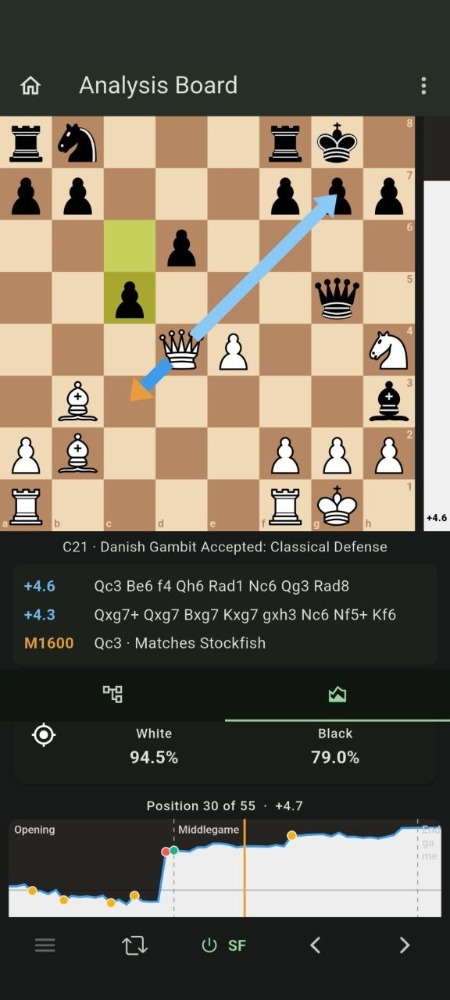
</p>

The evaluation graph plots the game from White's perspective and marks
classified moves. Tap anywhere on it to navigate directly to that position;
the board, move highlight, evaluation bar, arrows, and current annotation stay
in sync. The numeric evaluation remains at the advantaged side and follows the
board when it is flipped.

### Move classifications

<p align="center">
  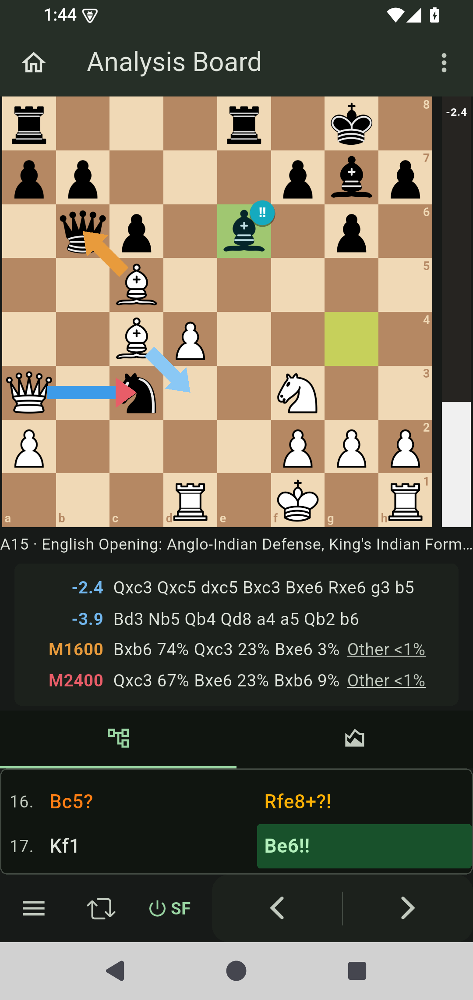
</p>

Review classifies moves as **Brilliant**, **Good**, **Interesting**,
**Dubious**, **Mistake**, or **Blunder**, with separate totals for both players.
Version 2.2 refines the classification heuristics so Brilliant moves are more
likely to receive the correct label; these classification categories are not new.
The screenshot shows Fischer's **17...Be6!!** from the 1956 Byrne–Fischer game
classified Brilliant by the signed Stable 2.2 app. The current classification
appears on the board and in the move list. You can
move pieces from any reviewed position to explore a branch without losing the
original game.

### Recent games and PGN files

<p align="center">
  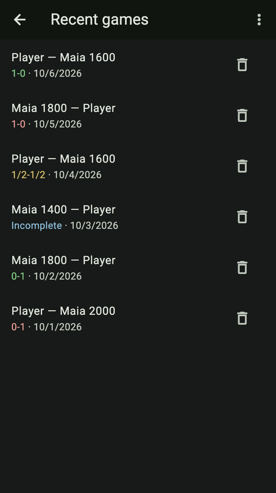
</p>

**Recent games** contains completed games and unfinished games explicitly saved
with Home. Each entry now identifies the player side and Maia rating (for
example, **Player — Maia 1600**) and shows the actual result (**1-0**, **0-1**,
or **1/2-1/2**) or **Incomplete**, plus the original played date. Opening or
analysing a record changes neither its date nor its chronological position.
Older records without a reliable played date show **Date unknown**.
Only the result text is coloured: green for the player's win, red for a loss,
amber for a draw and blue for incomplete. A `1-0` is therefore green if you
played White and red if you played Black; unknown results stay neutral.
It supports
multi-select, select all, selected deletion, and delete all. An unfinished
record becomes the same completed record when play ends.
Because Android can erase private app data on uninstall, use **Save PGN file**
or **Share PGN** for an independent copy.

**Open PGN file**, Android's Open with action, and shared attachments import one
game with its variations, comments, and annotations. Files are limited to 2 MB
and 20,000 moves across all branches; the first game is used when a document
contains several games.

### About, privacy, and licences

<p align="center">
  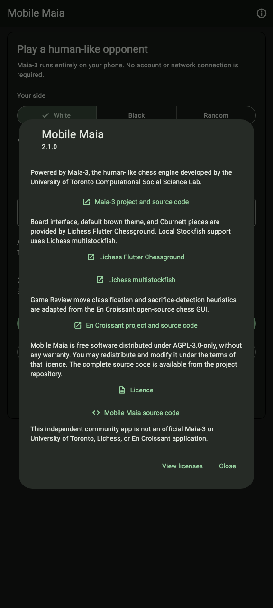
</p>

The app has no accounts, ads, subscriptions, tracking, or network dependency.
The download is several hundred megabytes because it bundles the
Maia-3 79M model so play and analysis stay on the device. The About screen
shows the installed version, AGPL terms, warranty notice, source and licence
links, and upstream credits.

Diagnostics are pruned to at most 14 days, 40 entries, 8,000 characters per
entry, and 128,000 characters total. They may include app, Android, hardware,
engine-cache, and privacy-safe Bluetooth state, but never a device serial,
Bluetooth address or board name, chess position, or PGN.

## Install and update with F-Droid

Mobile Maia is available from the official F-Droid repository. Install the
[F-Droid client](https://f-droid.org/F-Droid.apk), then search for **Mobile
Maia** or open the
[Mobile Maia package page](https://f-droid.org/packages/com.dash1971.maia_chess/)
on your Android device. F-Droid can install the app and notify you when future
updates are available.

The package page also provides a direct APK download for manual installation.

## Install and update with Obtainium

[Obtainium](https://github.com/ImranR98/Obtainium) installs Android apps directly
from their official release pages and can notify you when updates are available.

1. Install Obtainium from its
   [official releases page](https://github.com/ImranR98/Obtainium/releases/latest).
2. Open Obtainium, select **Add App**, and paste this URL into **App Source URL**:

   ```text
   https://github.com/Dash1971/maia-chess-android
   ```

3. Confirm that Obtainium detects **GitHub** as the source. Leave
   **Include prereleases** disabled to receive stable versions only.
4. Select **Add**, open **Mobile Maia** in Obtainium, and select **Install**.
5. If Android asks, allow Obtainium to install unknown apps, then approve the
   Mobile Maia APK installation.

After setup, use Obtainium's update check to download and install future Mobile
Maia releases. Android may ask you to confirm each update.

## Build

Requirements: **Flutter 3.47.5** (pinned in `.fvmrc`), JDK 17, Android SDK 36,
Python 3, and Git LFS. Use the locked dependencies. A GitHub source ZIP contains
an LFS pointer rather than the 316 MB Maia model, so clone with Git LFS:

```sh
git clone https://github.com/Dash1971/maia-chess-android.git
cd maia-chess-android
git lfs install
git lfs pull
python3 tool/verify_model.py
flutter pub get --enforce-lockfile
flutter analyze
flutter test
tool/build_android_release.sh
```

The APK is written to `build/app/outputs/flutter-apk/app-release.apk`. Release
builds intentionally keep readable Dart symbols: Mobile Maia is open source,
readable crash traces are more useful than obfuscation, and deterministic
symbols allow independent reproducibility checks. The script also verifies the
model's exact size and SHA-256 so an incomplete Git LFS checkout cannot silently
produce a broken release. See [`REPRODUCIBLE_BUILDS.md`](REPRODUCIBLE_BUILDS.md).

To check reproducibility, build the **same commit** in two clean directories
with the same pinned toolchain and no signing variables, then compare the
unsigned APKs using `sha256sum`. Retain both hashes with the release notes; the
procedure is not itself evidence that a particular release reproduced. The
manual Checks workflow can build an unsigned APK; pull requests run the Dart
analyzer and regression tests.

The release verifier accepts the stable universal package explicitly:

```sh
python3 tool/verify_release_apk.py \
  build/app/outputs/flutter-apk/app-release.apk \
  --package com.dash1971.maia_chess \
  --allow-abi armeabi-v7a --allow-abi arm64-v8a --allow-abi x86_64 \
  --output release-checks/apk.json
```

Dependency advisory checks run in CI without adding runtime app work. Their
coverage and the required upstream review are documented in the release guide.

Maintainers and coding agents should start with the
[release procedure and qualification gate](docs/RELEASING.md) before signing,
tagging, or publishing. The [release verification guide](tool/hardening/RELEASE_CHECKS.md) includes
portable APK checks, sanitized saved-game upgrade fixtures, emulator commands,
and CI artifact retention. See the [hardening guide](tool/hardening/README.md)
for the full regression suites and independent chess/variation corpora.

Official releases are signed with the dedicated Mobile Maia app-signing key.
The build reads `MOBILE_MAIA_KEYSTORE`, `MOBILE_MAIA_STORE_PASSWORD`, and
`MOBILE_MAIA_KEY_PASSWORD` from the environment; no signing secrets belong in
this repository. When those variables are absent, Gradle produces an unsigned
release suitable for independent F-Droid rebuilding.

The official signing certificate SHA-256 digest is:

```text
cd6c07c4efacf52bcccb83009b522c1dcad4a171197505a486f0a58edb6f172e
```

## Re-export Maia-3

The checked-in ONNX model was exported from the official Maia-3 79M checkpoint.
The exporter verifies ONNX Runtime outputs against PyTorch before succeeding.

```sh
python -m pip install /path/to/maia3 onnx onnxruntime
python tool/export_maia3_onnx.py --model maia3-79m --output assets/models/maia3-79m.onnx
```

## Credits and attributions

Mobile Maia uses the
[Maia-3 project](https://github.com/CSSLab/maia3) and its 79M model. Maia-3 was
created by the University of Toronto Computational Social Science Lab to model
human chess move choices at different rating levels.

The board interface is provided by
[Lichess Flutter Chessground](https://github.com/lichess-org/flutter-chessground),
including the default Lichess brown theme and Cburnett pieces. Local Stockfish
support uses
[Lichess multistockfish](https://github.com/lichess-org/dart-multistockfish).
Opening names and ECO codes come from the CC0
[Lichess chess-openings dataset](https://github.com/lichess-org/chess-openings),
pinned to the source revision recorded in
[`THIRD_PARTY_NOTICES.md`](THIRD_PARTY_NOTICES.md). Analysis Board interactions
are also informed by the open-source
[Lichess Mobile analysis experience](https://github.com/lichess-org/mobile).
Mobile Maia is independently implemented and is not affiliated with Lichess.

Experimental Chessnut support uses Chessnut's
[published e-board API](https://github.com/chessnutech/Chessnut_eBoards) and
MIT-licensed [EasyLinkSDK](https://github.com/chessnutech/EasyLinkSDK), and was
cross-checked against Roberto Marabini's GPL-3.0
[chessnutair](https://github.com/rmarabini/chessnutair) reference
implementation. Mobile Maia's Bluetooth transport uses Android's native BLE
APIs. Protocol sources, copyright notices, licence terms, and adaptation
details are recorded in [`THIRD_PARTY_NOTICES.md`](THIRD_PARTY_NOTICES.md).

Game Review's move-classification and sacrifice-detection heuristics are
adapted and translated to Dart from
[En Croissant](https://github.com/franciscoBSalgueiro/en-croissant), the
open-source chess GUI by Francisco Salgueiro and contributors. The pinned
upstream revision and licence details are recorded in
[`THIRD_PARTY_NOTICES.md`](THIRD_PARTY_NOTICES.md).

## Licensing

Copyright (c) 2026 Dash. Original application code in this repository is
licensed under the [GNU Affero General Public License v3.0 only](LICENSE)
(`AGPL-3.0-only`). Contributions are accepted under the same licence.

Mobile Maia as a combined application is distributed under AGPL-3.0-only.
Individual third-party components retain their respective copyright notices
and licences, notably Maia-3 (AGPL-3.0), Stockfish/multistockfish (GPL-3.0),
dartchess (GPL-3.0), and adapted En Croissant code (GPL-3.0). See
[`THIRD_PARTY_NOTICES.md`](THIRD_PARTY_NOTICES.md).

This is an independent community project and is not an official Maia Chess,
University of Toronto CSSLab, Stockfish, Lichess, or En Croissant application.
