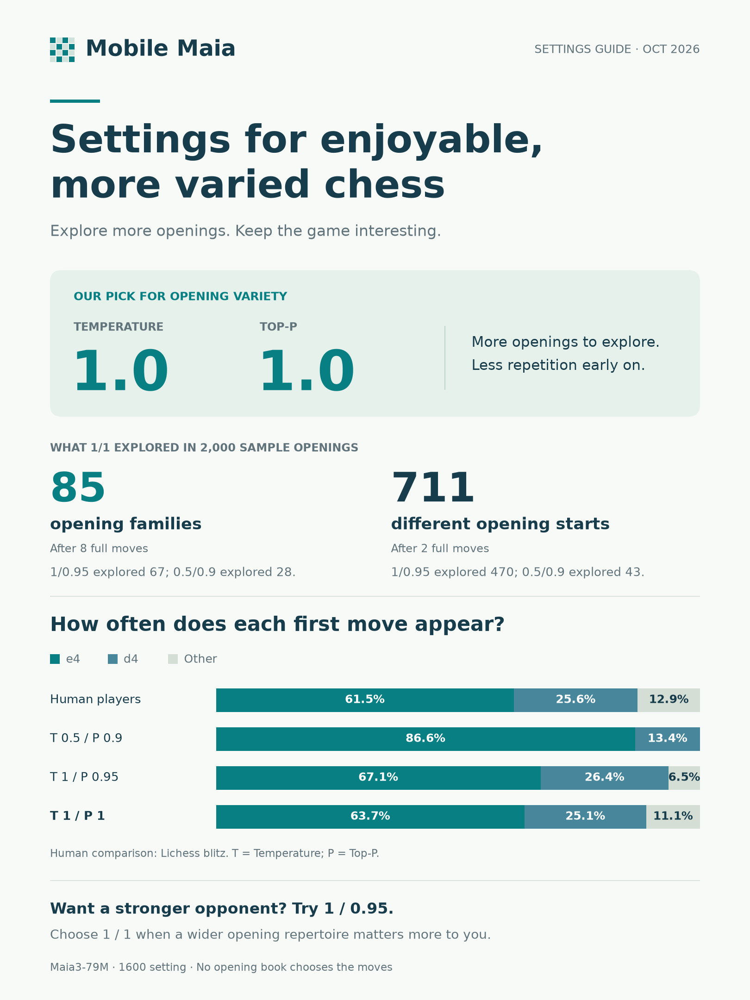
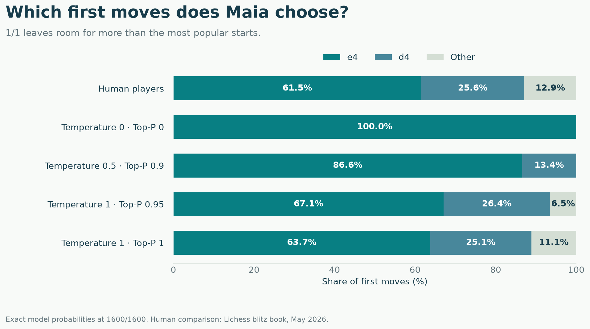
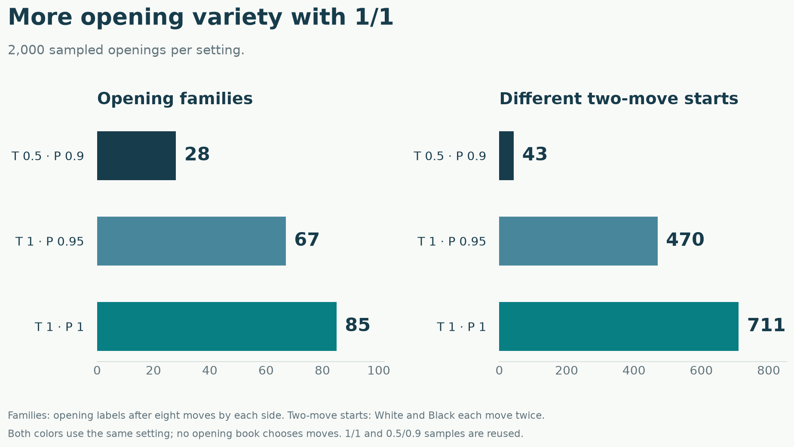
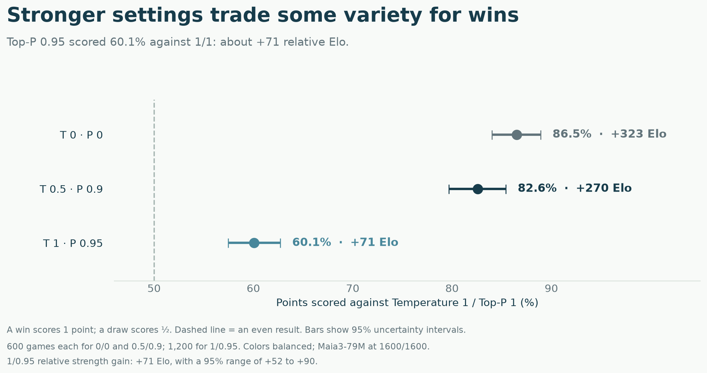

# Which Temperature and Top-P settings should Mobile Maia use?

We want Maia to be an enjoyable chess opponent: familiar openings, different games, and the occasional surprise. But the settings that make Maia more predictable also tend to make it harder to beat. How much variety should we give up for strength?

We tested that tradeoff at the **1600 setting**, using the model and move-selection rules in Mobile Maia. Our choice is **Temperature 1.0 / Top-P 1.0**. It gives us the broadest opening repertoire of the settings we tested, with a first-move mix close to the Lichess players we compared it with. **Temperature 1.0 / Top-P 0.95** is a useful stronger alternative, but it removes some sidelines we would like to keep.

This is a practical project by chess fans choosing defaults for an app. Below are the examples that made the decision for us, followed by the game results and the files for anyone who wants to dig deeper.

[How the controls work](#two-controls-one-tradeoff) · [Openings](#what-happens-on-move-one) · [Strength](#how-much-stronger-are-the-lower-settings) · [Our choice](#our-choice-for-mobile-maia) · [Data and code](README.md)

## Two controls, one tradeoff

Maia gives each legal move a probability: its prediction of how often a human player would choose that move. It then draws a move from those probabilities. A popular move gets picked often; an unusual move gets picked occasionally.

**Temperature changes the odds.** At **1.0**, Maia keeps its original probabilities. Turning it down gives the leading moves more of the share. At **0.5**, a move that was twice as likely as another becomes four times as likely. At **0**, Maia always picks its most likely move.

**Top-P trims the list.** After Temperature has changed the odds, Top-P sorts moves from most to least likely and keeps enough of them to reach the selected share of probability. At **0.95**, it keeps at least 95% of that probability and cuts off the remaining tail. At **1.0**, nothing is cut off. This is a share of probability, not a share of the number of moves.

Why does trimming help strength? The unlikely tail contains a disproportionate share of mistakes. In the positions we checked, about **63% of the probability removed by Top-P 0.95** belonged to moves Stockfish rated substantially worse than its preferred move. Lower settings reduce the chance of picking those moves.

But the same tail also contains perfectly playable, less popular choices. The controls cannot distinguish an interesting sideline from a mistake just because both are uncommon. That is the tradeoff we wanted to see on the board. [Move-quality checks](followup/audit/README.md).

## How we tested

The main tests use **Maia3-79M**, the app's model, with both rating inputs set to **1600**. Maia played from the normal starting position, **without an opening book or engine search choosing its moves**.

| Temperature / Top-P | What it does |
| --- | --- |
| **0 / 0** | Always picks the most likely move. Top-P makes no difference at Temperature 0. |
| **0.5 / 0.9** | Heavily favors popular moves and removes the tail. |
| **1 / 0.95** | Keeps the original odds, then removes a small tail. |
| **1 / 1** | Keeps Maia's full set of move probabilities. |

We asked three questions:

1. **Does the opening mix look like human play?** We compared Maia's probabilities with rating-filtered Lichess blitz and rapid games, including 450 sampled opening paths with 4,581 position comparisons. A separate sample of actual game sequences checked the results beyond move one.
2. **How different are the games?** We generated 2,000 opening sequences for each setting that samples moves, through eight full moves. The deterministic 0/0 setting produces one sequence when both sides use it.
3. **How much strength changes?** We played direct matches with equal games as White and Black. The 1/0.95 versus 1/1 comparison alone contains 1,200 games. Additional tests changed one control at a time and checked the smaller 5M model.

Altogether, the two rounds of testing on **2–3 October 2026** produced **4,200 complete matches and 6,001 opening sequences**. The follow-up added 1,200 matches and 2,000 sequences; it reused the same human references and the saved 1/1 opening sample. Game records and exact methods are linked at the end.

## What happens on move one?

This is the easiest difference to see. The chart compares Maia's first-move probabilities with the opening choices in our roughly 1600-rated Lichess sample.

Think of the percentages as the expected mix over many games:

| First move | Lichess blitz reference | 0 / 0 | 0.5 / 0.9 | 1 / 0.95 | 1 / 1 |
| --- | ---: | ---: | ---: | ---: | ---: |
| **e4** | 61.5% | 100% | 86.6% | 67.1% | **63.7%** |
| **d4** | 25.6% | 0% | 13.4% | 26.4% | **25.1%** |
| **Everything else** | 12.9% | 0% | 0% | 6.5% | **11.1%** |

At **0.5/0.9**, Maia can start only with **e4 or d4**, and e4 dominates. At **1/0.95**, **c4, Nf3 and e3** join the mix. At **1/1**, **g3, b3, f4** and other uncommon starts also get their occasional turn. The rapid reference has a little more e4 than blitz, but the same broad pattern holds.

These are calculated probabilities from the model, rather than counts from a small batch of games. Full sampling does not make the moves equally likely: e4 and d4 still account for almost nine games out of ten. [Exact first-move values](first-move-probabilities.json) · [0.95 values](followup/openings/exact-policy95.json).

## It changes Black's replies, too

After **1.e4**, the 0.5/0.9 setting permits only **…e5, …d5 or …c5**. The French (**…e6**) and Caro-Kann (**…c6**) disappear as immediate replies. Both return at 1/0.95 and 1/1.

| Opening move or reply | 0.5 / 0.9 | 1 / 0.95 | 1 / 1 |
| --- | :---: | :---: | :---: |
| **1.c4** — English opening | — | Yes | Yes |
| **1.Nf3** | — | Yes | Yes |
| **1.g3, 1.b3 or 1.f4** | — | — | Yes |
| **1.e4 e6** — French Defence | — | Yes | Yes |
| **1.e4 c6** — Caro-Kann Defence | — | Yes | Yes |

The difference carries into longer games. Here is what appeared in equal samples of **2,000 openings per setting**:

| What appeared in the sample | 0.5 / 0.9 | 1 / 0.95 | 1 / 1 |
| --- | ---: | ---: | ---: |
| Different lines through two full moves | 43 | 470 | **711** |
| Opening families reached through eight full moves | 28 | 67 | **85** |

Here, an opening family means a broad label such as Sicilian Defence or Queen's Pawn Game, rather than every named subvariation. The counts show what appeared in these samples, not every opening a setting could ever reach.

**The 0.95 cutoff keeps plenty of variety, but its cost is noticeable:** 67 families instead of 85, and roughly a third fewer distinct lines through two moves. Less common choices can be lost at several turns, so trimming a small probability tail at each move can have a larger effect on the repertoire.

## Which opening mix looks more human?

Having more possible moves is only part of the story. We also checked how often the different choices appeared.

**1/1 came closest to the human move frequencies across the sampled opening positions.** That agrees with the move-one picture above. It also matched the later mix of opening families better than 1/0.95 in the blitz sample and a separate September sample.

**1/0.95 had a useful advantage of its own:** it matched the shares of common lines through two full moves better. The later rapid-game family comparison was close enough that we would not choose between the two on that result alone.

So 1/1 did not win every opening comparison. We prefer it because it combines a convincing overall mix with the uncommon choices we want to encounter. A game can leave a book while still being recognizably human chess; repeatedly staying in the most popular lines is not our only goal.

The detailed [opening results](openings.md) and [0.95 comparison](followup/openings/openings95.md) include the full frequency comparisons, uncertainty ranges and definitions of the statistical measures. The comparisons use fixed Lichess game samples and book snapshots, rather than the live opening explorer.

## How much stronger are the lower settings?

**Quite a bit.** Broad sampling brings more surprises, including more mistakes. This chart shows how each alternative scored in direct matches against **1/1**. Draws count as half a point, so 50% would be an even match.

| Setting playing against 1/1 | Games | Wins–draws–losses | Score | Elo advantage in these matches |
| --- | ---: | ---: | ---: | ---: |
| **0 / 0** | 600 | 489–60–51 | **86.5%** | **+323** (95% range: +288 to +362) |
| **0.5 / 0.9** | 600 | 476–39–85 | **82.6%** | **+270** (+237 to +307) |
| **1 / 0.95** | 1,200 | 671–100–429 | **60.1%** | **+71** (+52 to +90) |

These rows use Mobile Maia's draw rules. The original tests also recorded results with earlier claimable draws; using that convention gives essentially the same conclusions, including **+70** for 1/0.95.

The **0.95 gain is real enough to be useful**: it is a reasonable option if you want a tougher opponent while keeping a broad set of mainstream openings. It is also a much smaller change than lowering Temperature to 0.5.

The extra tests help explain the sliders. With Top-P kept at 1, lowering Temperature to 0.5 scored **83.2%** against 1/1. With Temperature kept at 1, lowering Top-P to 0.9 scored **67.8%**. Temperature made the bigger difference in those tests. The effects do not add together, so we would not promise a fixed Elo gain for every notch on a slider. [All match results and methods](strength.md) · [1/0.95 match records and checks](followup/strength/SUMMARY.md).

## Our choice for Mobile Maia

**We are choosing Temperature 1.0 and Top-P 1.0.** For us, an enjoyable Maia opponent should offer more than the strongest version of its most familiar moves. We want the English, the French, the Caro-Kann, the occasional flank opening and the sidelines that make games feel different.

That choice may make Maia feel **more chaotic and less skillful** at the same rating setting. You may see more odd moves, missed chances and unexpected openings. We are accepting that in exchange for a broader repertoire.

If you prefer a tougher, more predictable opponent for over-the-board-style practice, try **Temperature 1.0 / Top-P 0.95** first. Our tests found a useful strength increase without removing most mainstream openings. Lowering Temperature further makes Maia lean more heavily on its favorite moves; **0.5/0.9** is a substantially stronger, narrower option in these tests. The controls are there so you can choose the kind of game you enjoy.

There is one practical benefit to 1/1 as well. [Maia3 issue #14](https://github.com/CSSLab/maia3/issues/14) describes two ways to apply a Top-P cutoff: keep or discard the move that takes the running total over the threshold. Mobile Maia keeps it, and that is the version tested here. **At Top-P 1, the distinction disappears.**

### Why the app had different settings before

The previous **Temperature 0.5 / Top-P 0.9** settings came from work on the [Maia2 local stack](https://github.com/Dash1971/maia2-local-stack) and [Maia3 local stack](https://github.com/Dash1971/maia3-local-stack). Those projects used opening books, so the book could provide variety before Maia took over. The narrowing caused by the sampling settings was less obvious in the opening.

**Mobile Maia has no opening book.** Its own move choices have to supply that variety from move one. That is why, after these experiments—including the closer 1/0.95 comparison—we are choosing **1.0/1.0** for the app.

## For anyone who wants the details

The headline results above are for the **79M model at 1600**. We also tested the smaller 5M model, which supported the same broad strength-versus-variety tradeoff. Other rating settings have not been tested in this project.

Every match has saved moves and seeds. The 1,200-game follow-up passed an independent replay of all **107,794 moves**, with no illegal moves, mismatched results or games cut short by the length limit. The [reproduction guide](README.md) links the original and follow-up records, scripts and checks.

| What you want to inspect | Where to find it |
| --- | --- |
| Original test design, full match tables and draw-rule checks | [Protocol](PROTOCOL.md) · [Strength study](strength.md) |
| Human references, opening probabilities and sampled lines | [Opening study](openings.md) |
| 0.95 study: raw games, opening sequences, results and commands | [Follow-up archive](followup/README.md) |
| Which unlikely moves were mistakes? | [Move-quality diagnostic](diagnostics/README.md) · [0.95 diagnostic](followup/audit/README.md) |
| Independent verification of the 1,200-game comparison | [Audit](followup/audit/final-audit.json) |
| Paper, implementation review and community discussions | [Source review](literature.md) · [Discord notes](discord-evidence.md) |
| Downloading and reproducing the results | [Data and code guide](README.md) |

The source review includes the [Maia3 paper](https://arxiv.org/abs/2605.19091), the code and bot discussions that prompted these experiments. Community advice helped frame the question; the choice above comes from the tests in Mobile Maia's own setup.
